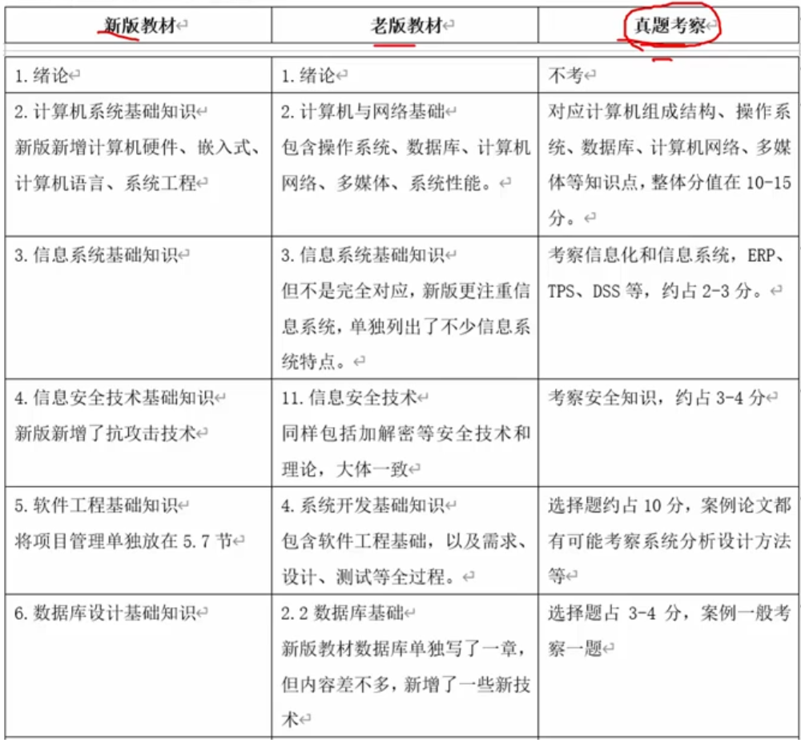
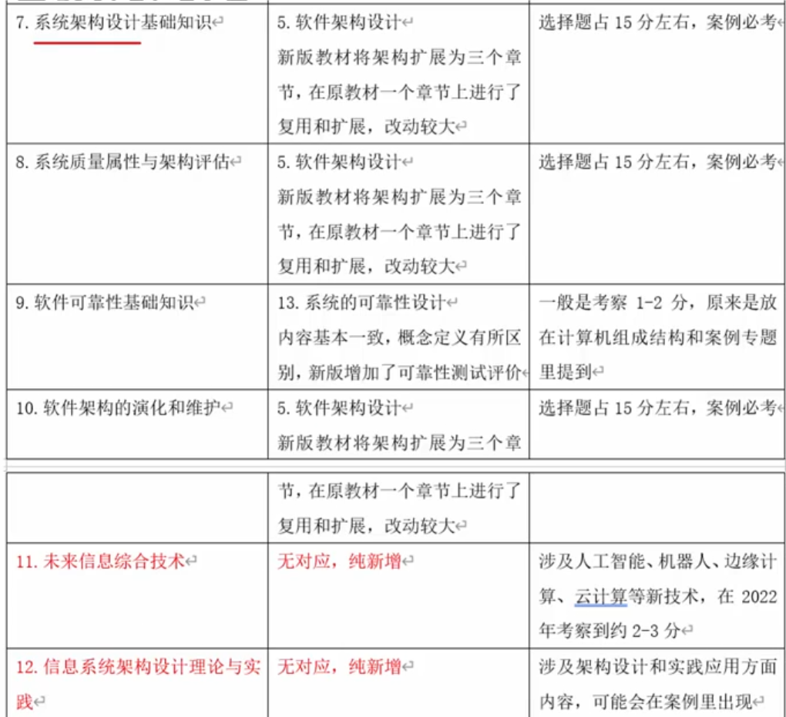
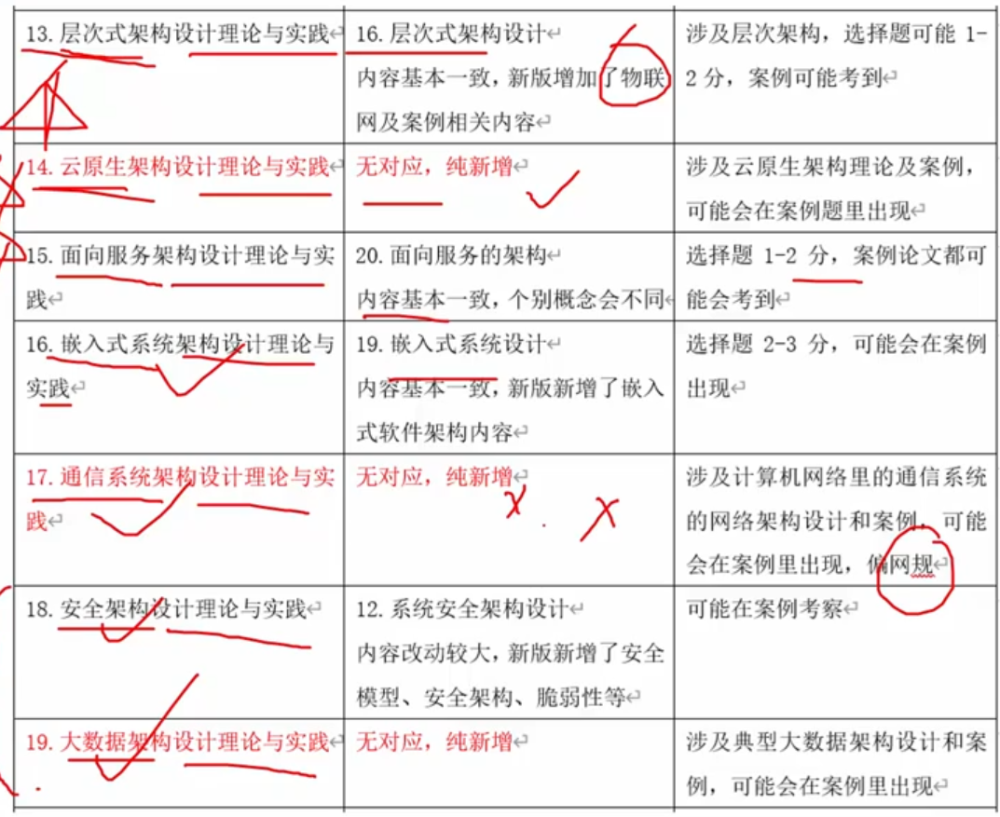
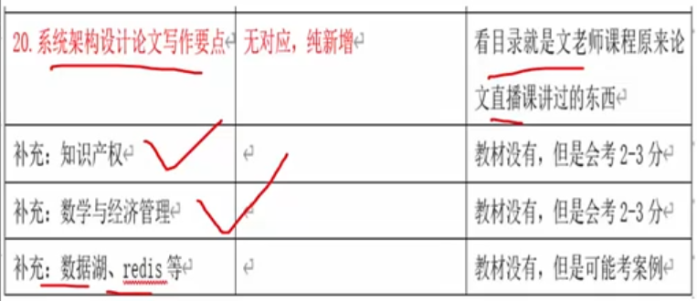
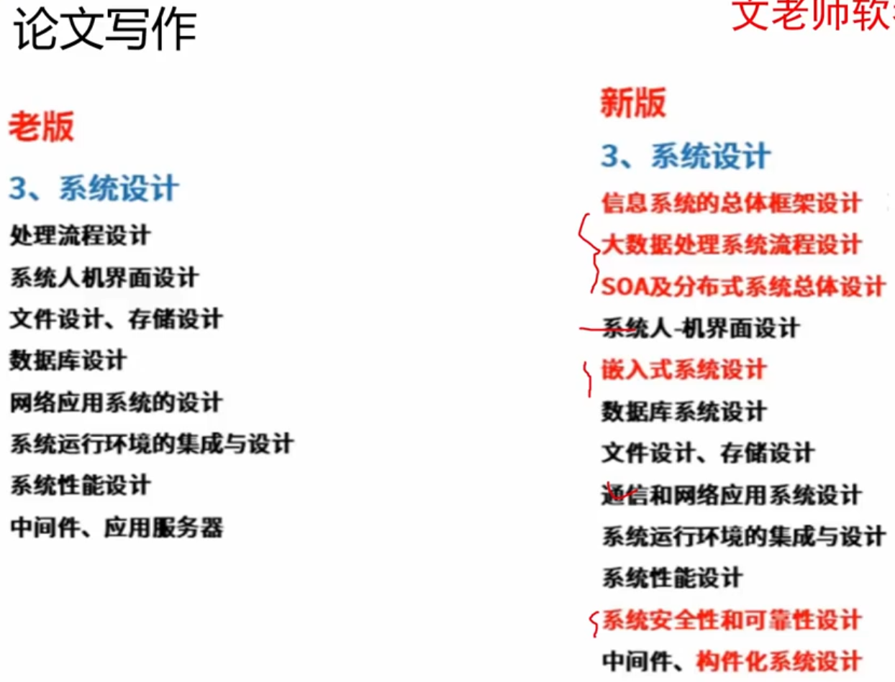
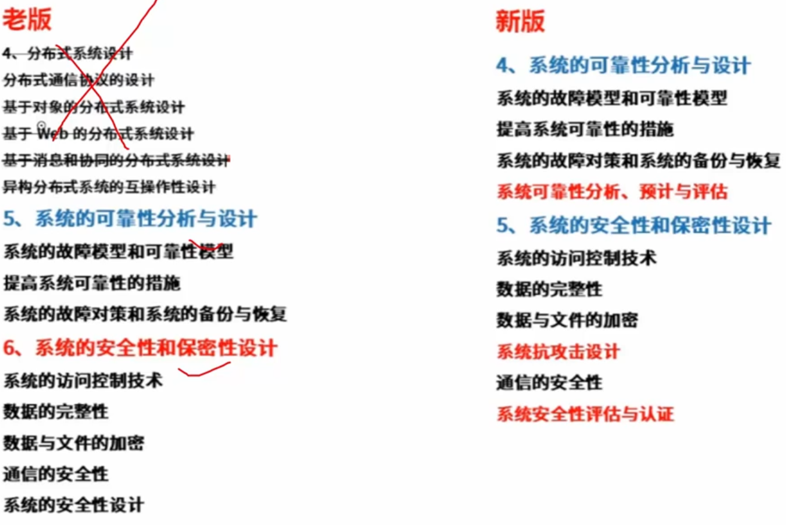
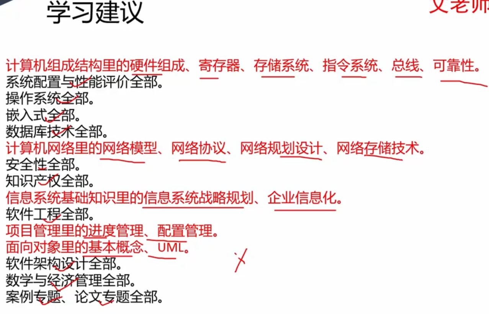

# 新老教材对比

上篇 - 1-11章 基础知识基本不变 - 选择题最爱
下篇 - 12-20章 架构设计+论文

## 删除的内容

不必学：

设计模式、XML、基于ODP的架构师实践、架构师管理实践、企业集成架构设计、面向方面的编程

稍微得知道一些：

UML建模、面向构建的软件设计、构建平台与典型架构

考试要求

1. 软硬件知识
2. 架构开发、验证、评估
3. 软件开发标准、信息技术标准
4. 系统建模、架构设计
5. 安全技术、安全架构 - 安全
6. 信息化和信息技术
7. 综合应用
8. 工程及应用相关技术
9. 应用数学
10. 英文

## 新老版本章节对比

**架构侧重点所在章节：**

12章、13章、14章、15章。其次18、19章节。16、17大概率不考

**学习重点**：如果时间来不及，那么 - 黑色全学；红色学习划线部分

