# 计算机网络

1. 七层模型
2. 局域网
3. TCP/IP 协议族

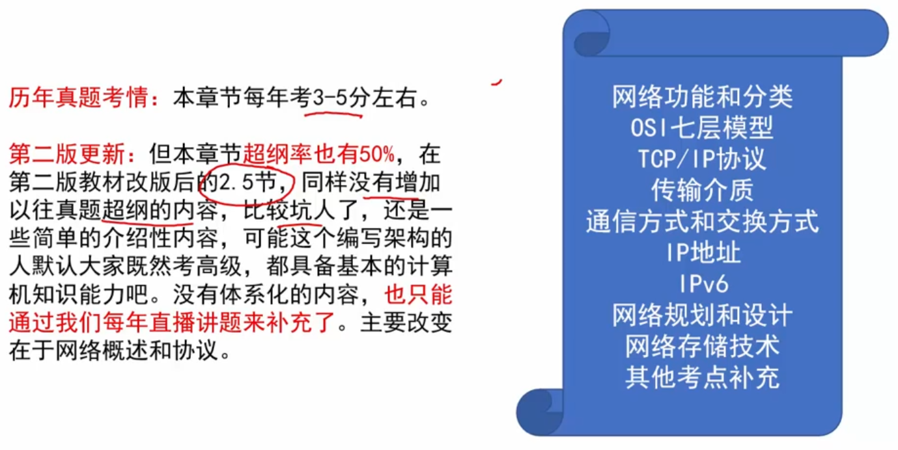

## pre. 网络功能和分类

 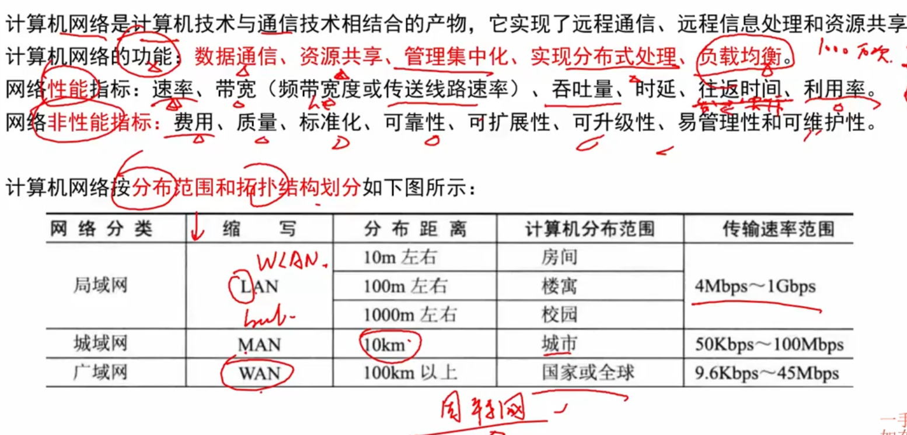

`LAN` - **Local Area Network** ； `MAN` - Metropolitan(大都市) ； `WAN` - Wide

###  相关有线连接的拓扑图 （拓扑 - Topology）

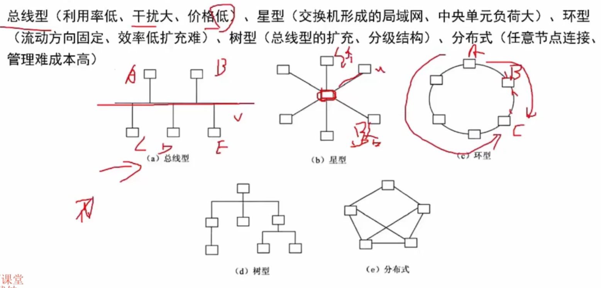

- 总线型 - 同一时间只能有一个终端在发送（串行、有点类似外设进程哦）

- 环形 - 是有双向箭头的
- 分布式 - 任何两个终端都相连，理想模式

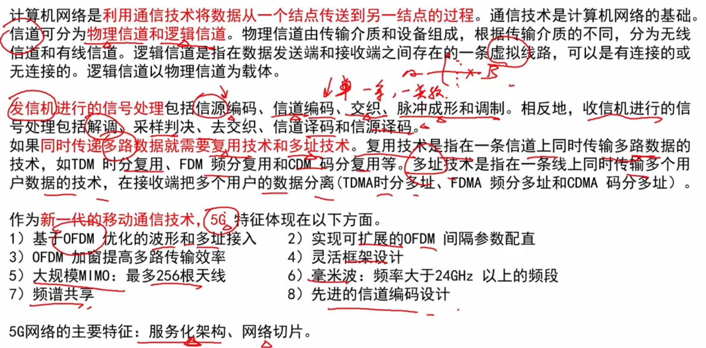

## 1. OSI七层模型

> 重点，基本要背下来

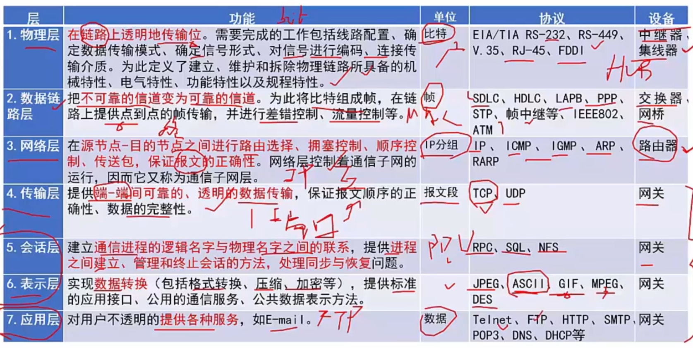

- 单位和设备，要记下来。协议从网络层开始记就可以了
- 集线器： Hub，也就是多合一等外设转接头
- 数据链路层：点到点 - 也就是计算机（的网卡）到计算机（的网卡）（对应的是局域网）；网桥就是多口交换机。交换机一般只有8个口
- 传输层：端到端，指的是端口号到端口号。每一个进程、每一个协议，都有一个端口号
- 网关是通信的单位（关口），移动、联通、电信 才有

### 局域网和广域网协议

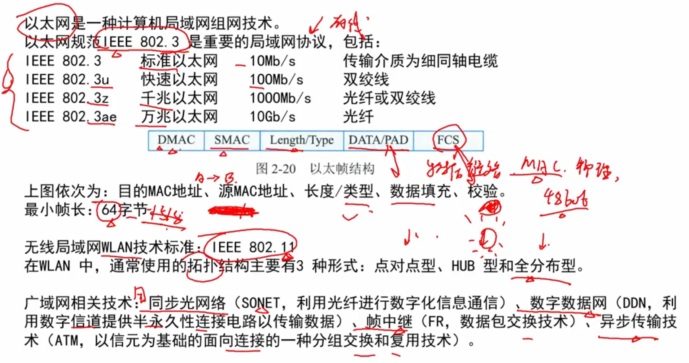

- 局域网 - 也叫以太网；广域网 - 典型代表是因特网； 他们处于 **数据链路层**

- `IEEE 802.3` 局域网协议，记住; `IEEE 802.11` 无线局域网协议

- 数据链路层用的是 MAC地址（物理地址、网卡上的地址），是个48位的地址

- 帧长 - 指的是 `Length/Type` 字段； 最大帧长是 `1518字节`
- 如果不满足最小64字节，就需要提供 `DATA/PAD` 进行数据填充
- HUB 类似 星形；全分布型是类似 网状

### TCP/IP 协议族

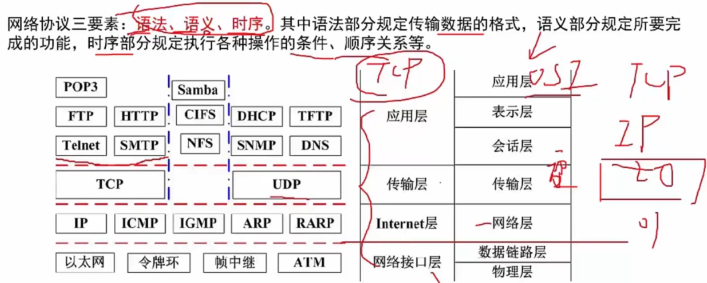

一般网络实际使用 TCP四层模型。OSI七层模型是理论上的； 其实还有OSI五层模型（把表示层和会话层干掉）-最常研究的

#### 具体协议

>  下面的协议，英文名和中文名要记住，考点！

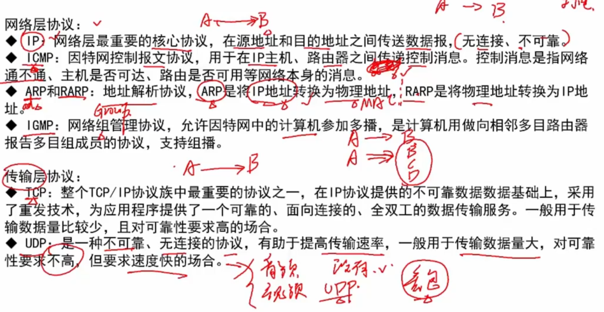

- `IP` - Internet Protocol ; `TCP` - Transmission Control Protocol； `UDP` - User Datagram Protocol
- `ARP` - Address Resolution Protocol； `RARP` - Reverse xxx
- `ICMP`- Internet Control Message Protocol
- `IGMP` - Internet Group Management Protocol
- `UDP` - 常用于音视频等流媒体

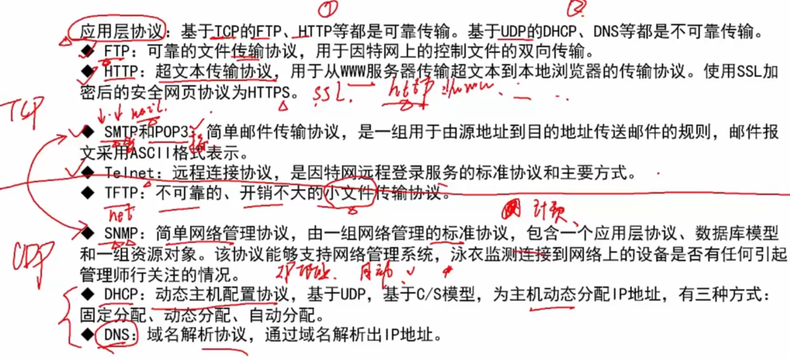

- TCP协议： FTP、HTTP、SMTP、POP3、Telnet
- UDP协议：TFTP、SNMP、DHCP、DNS

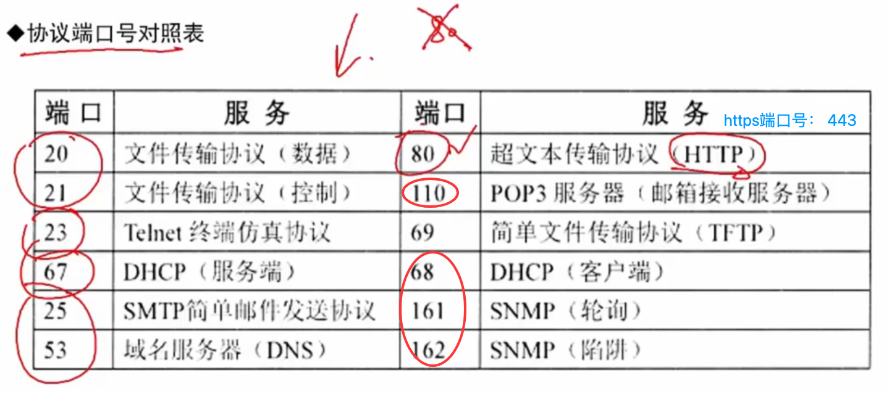

### 交换技术

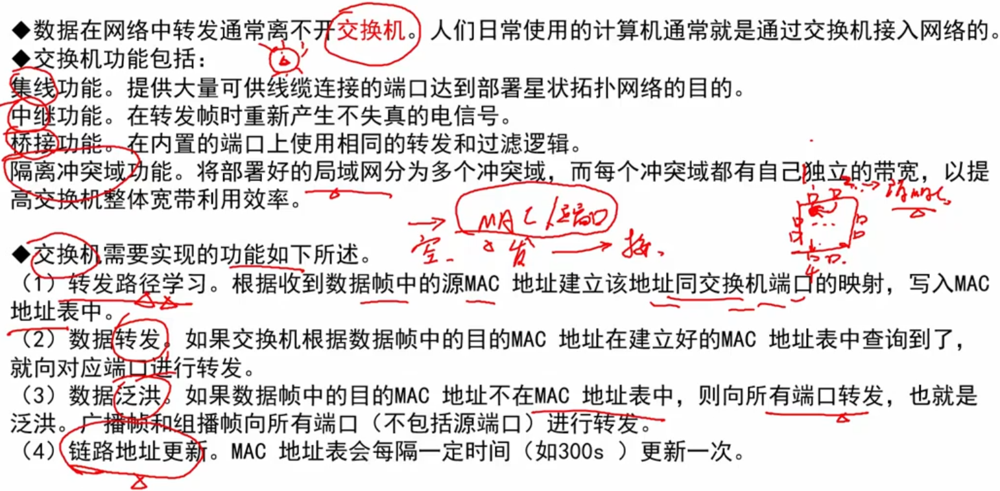

- 维护一个`mac地址（物理地址）和端口号`的映射/map表。自主学习的，也就是连接一个设备就记录一下映射
- 交换机隔离 冲突域

### 路由技术

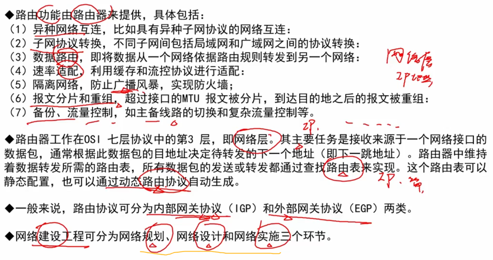

- 维护一个路由表，`IP地址和端口号`的映射，也是自主学习的

- 路由器隔离 广播域
