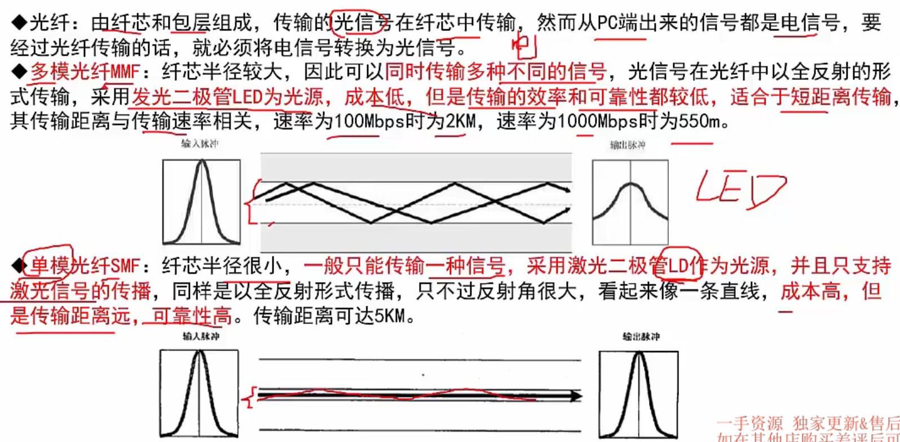

# 计算机网络

4. 传输介质
5. 通信方式
6. IP地址
7. 子网划分

## 4. 传输介质

### 网线

- 所以，网线有8根铜线。 RJ-45水晶头
- 网线传递电信号；光纤传输光信号

### 光纤

- MMF - multi ； SMF - single

## 5. 通信方式和交换方式

- 工就是工作（方向）。双工就是双工作方向

- 同步方式，相当于首先建立一个连接（同步帧），不需要额外在每个字段都`加上起始位和停止位`

- 交换方式 - 比较重要了
- 存储转发 - 中间经过的每一个节点，都会保存一下报文，保证`局部报文的`完整性和正确性（有头有尾）再转发

真题两道

## 6. IP地址表示

- 建议：把 2的10次方 的数字都给记一下，快速记住第一个点前面的十进制值是多少

### IP地址分类 - 重要 - 全要记住

- ABC 类 是主要考点； ABC类是`单播地址`；D类是 `组播地址`；E类为`保留地址`

- 背住二进制的区别，且学会转换成十进制，就相当于背住了

- 共有`2^24 - 2` 个地址，因为规定不能为最大值 `0.0.0.0` 和 最小值`255.255.255.255`
- A类大型；B类中型；C类小型（家用）
- 有下划线的是网络号，所以A类是8位，B类是16位，C类是24位，D类E类没有网络号

- 无分类编址没懂？ 网络号位数作用：IPv4地址固定32位主机号就是`32 - n`，比如12位，此时可以支持`2^12`个机器地址

- NAT协议，把私有地址转换成公有地址的协议
- 169.254.x.x - 自动专用地址 - DHCP协议相关用的

## 7. 子网划分

- 需要的子网数量计算： 要求：`2^N - 2 > 目标的主机数量比如30个`； N 大于等于 5; 5就是主机位，`32-5 = 27` -> 27 就是我们的网络位，也就是 ip/网络号 后面这个网络号（网络位）
- 一个C位地址是24位，所以子网号就是 27 - 24 = 3位； 所以划分成了 `2^3` 个子网（子网数量不需要 -2），每个子网 可以最多有 `2^5`个主机

- 需要学会求`子网掩码`，比如27位的网络号，5位的主机号， 那就就是 `27个1` 和`5个0 `  组成的32位。 用点分位划分一下，前27位都是1 -> `255.255.255.x`，最后8位是 `111 00000` ， 转换成十进制就是 224，所以最终 `255.255.255.224`
- 主机号千万记得要  `减2`，即使是子网主机号，也要减2

- 属于同一个网段的IP地址，网络号必然是相等的。比如网络号是前20位，那么就是前20位相同，也就是这样的32位 -  `8位.8位.4位(补0or补1凑8位判断范围区间).任意8位`

- 真题，要背一下，和上面讲的对应上了。
- 第二题：C类子网的网络号是24位（别问为什么，看上面ip地址那张图，下划线划了8位数字，要背住的），20 -> 24位，则有 2^4 个 子网
