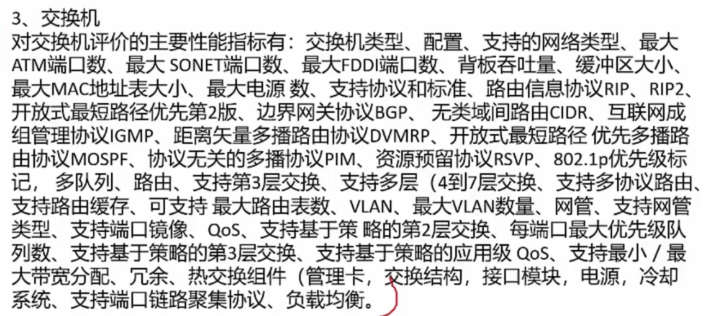

# 7. 系统配置与性能评价

> PS: 阿姆达尔解决方案 - 从没考过

## 1. 性能指标

- 标红的记一下
- 对于工程师，是建议好好记住的

### 下面是需要重点掌握的

### 考试真题

## 2. 性能评价方法

- 3MIPS  -  三百万条指令/秒
- 最多且最频繁的那部分程序，叫做`基准测试程序`，不叫`核心程序` - 考点

### 基准程序

- 需要记住 TPC(事务处理性能委员会) 基准程序中的 `TPC-C/OLTP` ，`TPC-D`， `TPC-E`

## 3. 阿姆达尔解决方案

增强比例 - 有多少比例的硬件增强，而不是指 强化度
