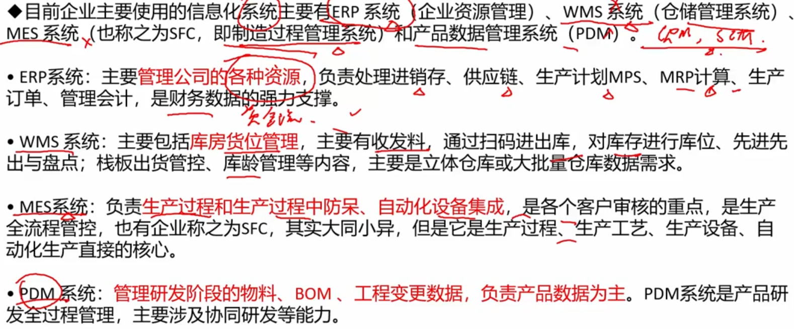

# 8. 信息系统基础知识

1. 信息系统概述
2. 生命周期
3. 开发方法
4. 详细系统

## 1. 信息系统概述

### 分类

- 中英文对照要记住
  - 业余（数据）处理系统 TPS/ DPS  - 局部
  - 管理信息系统 MIS  - 全局（企业内部）
  - 决策支持系统 DSS - 帮助 决策者CEO等
  - 专家系统 ES
  - 办公自动化系统 OAS

- 结构化 - 清晰的，有步骤地。DSS解决`半结构化或者非结构化`的决策问题

### 企业使用的具体信息化系统

- WMS - 仓储管理系统； MES - 制造过程管理系统；PDM - 产品数据管理
- 还有CRM - 客户关系管理；SCM - 供应链管理

## 2. 生命周期

- 新版生命周期：产生 -> 开发 -> 运行 -> 消亡
- 产生阶段就会有 `需求分析报告`
- 开发阶段有 5个 阶段，`规划` - `分析` - `设计` - `实施` - `验收`
  - 规划的是系统的战略作用等，不是规划细节
  - 实施子阶段包含 `测试` 和 `试运行`

- 运行阶段 时间最长，包含运行和维护
- 信息系统的初期`产生阶段`，就应该考虑`消亡`
- 规划 - 都是自顶向下；实现 - 都是自底向上

## 3. 信息系统的开发方法

- 结构化 - 需求明确（中小型）
- 面向原型 - 需求不明确（大型）
- 面向对象 - OO - 最主流
- 面向服务 - SO

- 为什么用原型 - 许多甲方看不懂文档
- 面对对象，是从现实和实际应用的角度 设计的

## 4. 详细系统

### 业务处理系统TPS - 初级系统

### 管理信息系统MIS

> 根据上面的示例演化的组成，了解即可

### 决策支持系统DSS

两库结构 - 数据库 + 模型库

> 作用和特点，看一下就行了

#### DSS组成

- 聚类 - 天然就有的；分类 - 人为划分的

- 1、2、3 针对的是数据库；4针对的是模型库，它反而是最复杂的，因为给出的是真实场景
