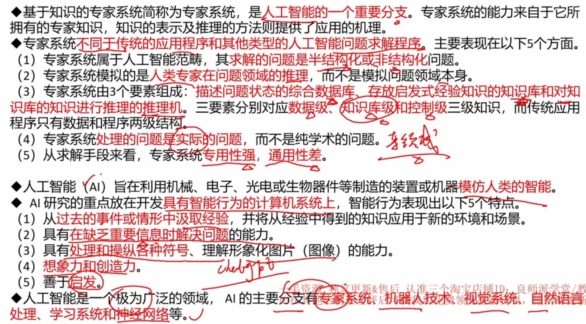
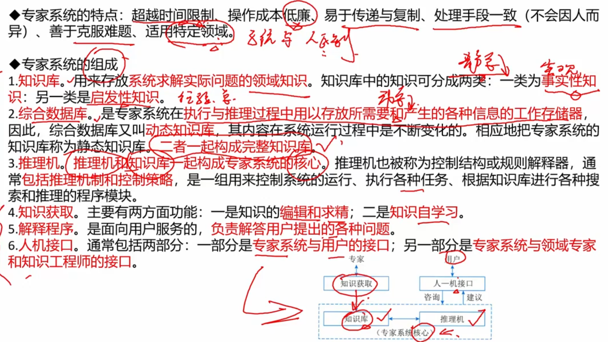
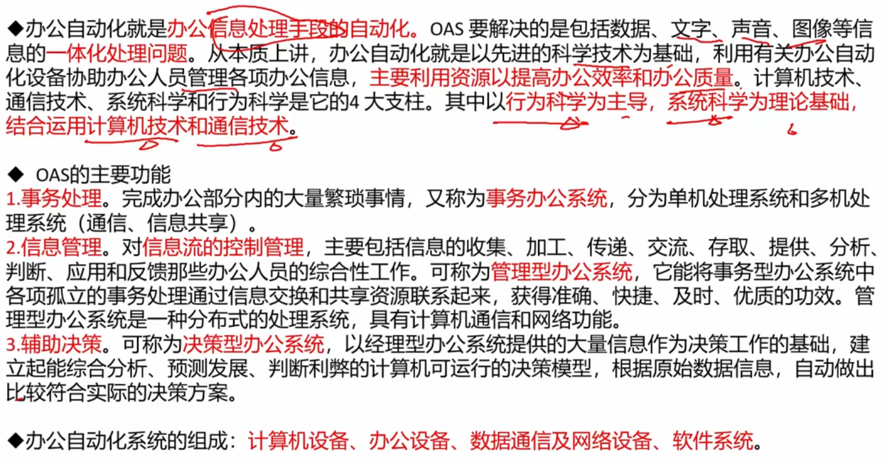
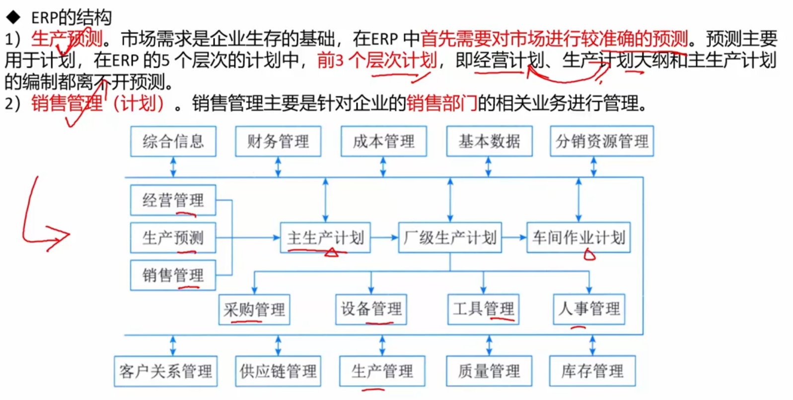
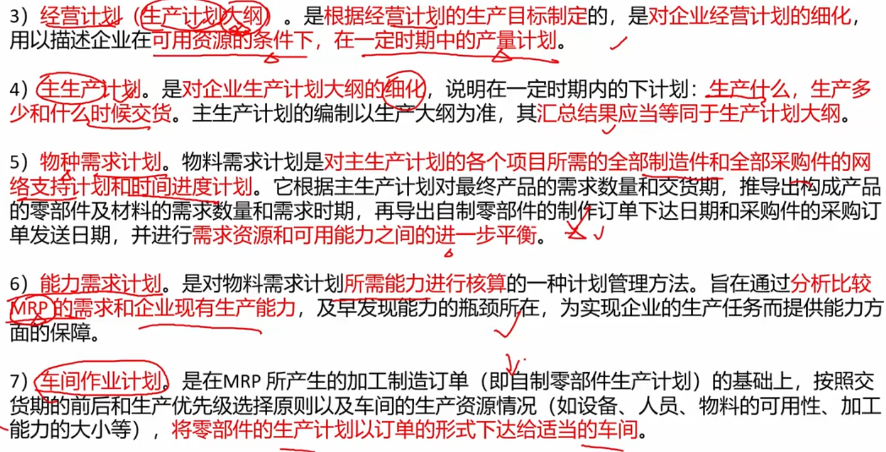
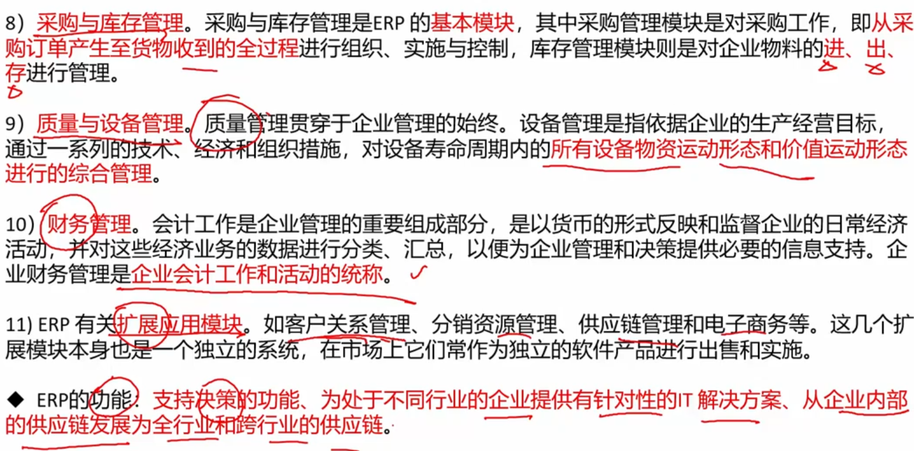
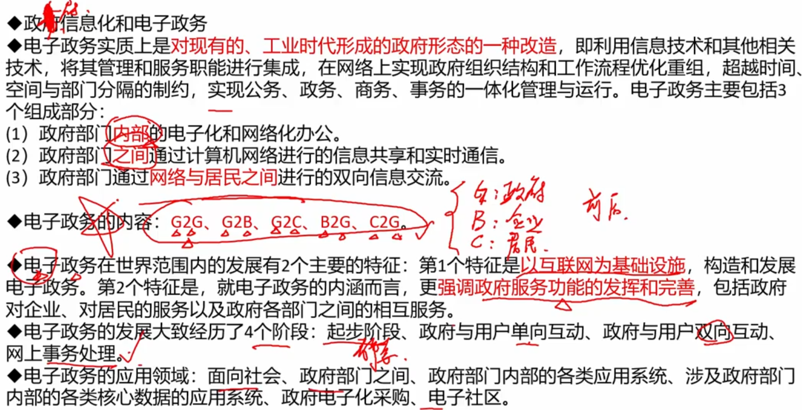
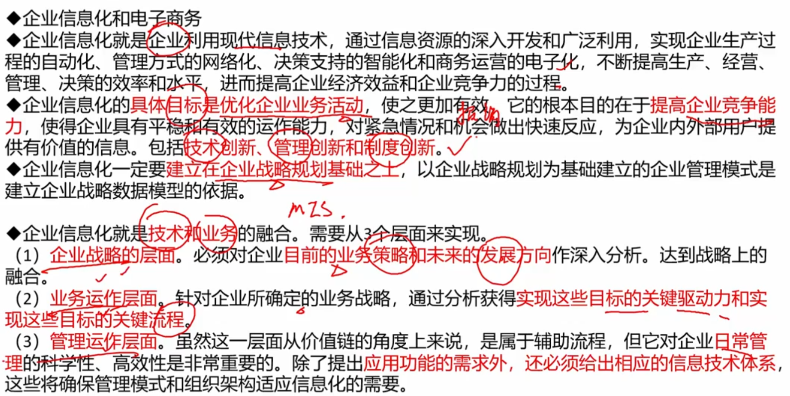
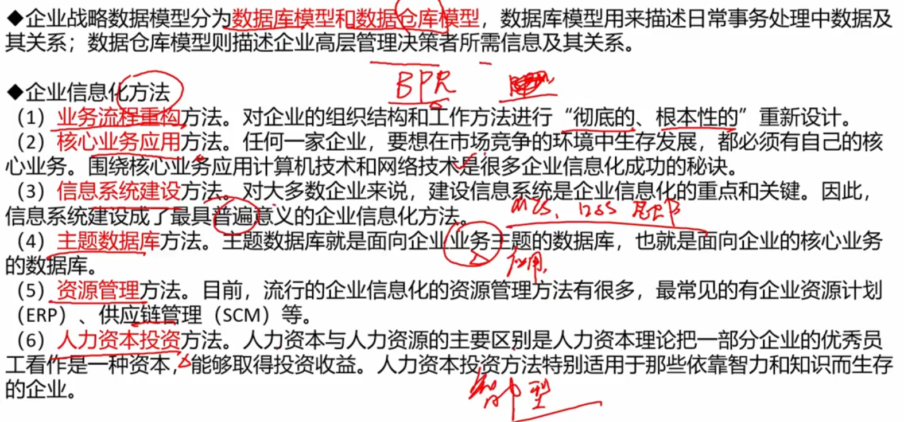

# 8. 信息系统基础知识

4. 详细系统
4. 典型信息系统架构模型

## 4. 详细系统 （后半段）

### 专家系统ES

### 办公自动化系统 OAS

### 企业资源规划 ERP

#### 结构

>  下张图是五个层次； MRP - 物料资源计划

> 四个模块

## 5. 典型信息系统架构模型

### 政府信息化和电子商务

### 企业信息化和电子商务

