# 计算机硬件

> 考的概率很少

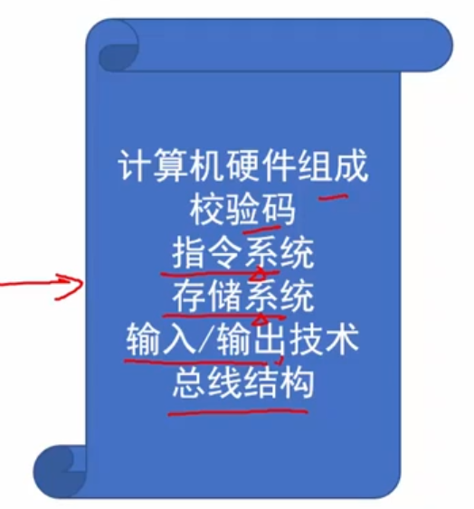

## 1. 计算机硬件 - cpu - 校验码

### 计算机基本五大硬件：

`运算器`+`控制器` 部件 - 被集成到一起，称之为 CPU （central Processing Unit) - 中央处理单元

CPU其他部位有 - 寄存器组（比如64bit，贼小的存储器）、内存总线

`存储器` - 内部存储器（内存） + 外部存储器（硬盘、光盘、U盘）

`输入设备`+`输出设备` - 外部设备（外设）

### CPU功能

1. 程序控制 - 下面三个都是控制器
2. 操作控制
3. 时间控制
4. 数据处理 - 运算器 - 算术运算和逻辑运算

5. 对系统内部和外部的中断（异常）做出响应和处理

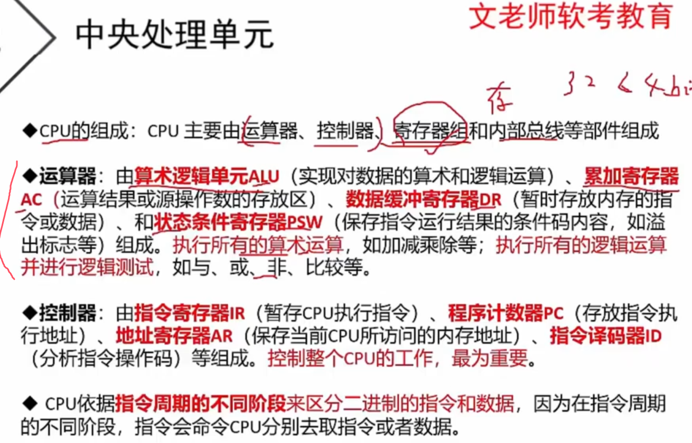

程序计数器PC - 这个才是存储所有的指令所在的地址，这样方便未来读取地址

地址寄存器AR - 当前CPU访问的内存地址

考点（最后一句）：CPU依据`指令周期的不同阶段`来区分`指令` or `数据`

### 校验码

**没懂**： 奇偶码数原因；

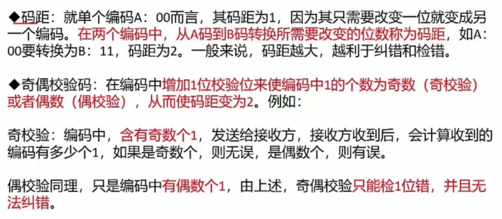

ps： **奇偶校验**码距为2的原因：一个校验位+一个错误位置（当有错误的时候用的）

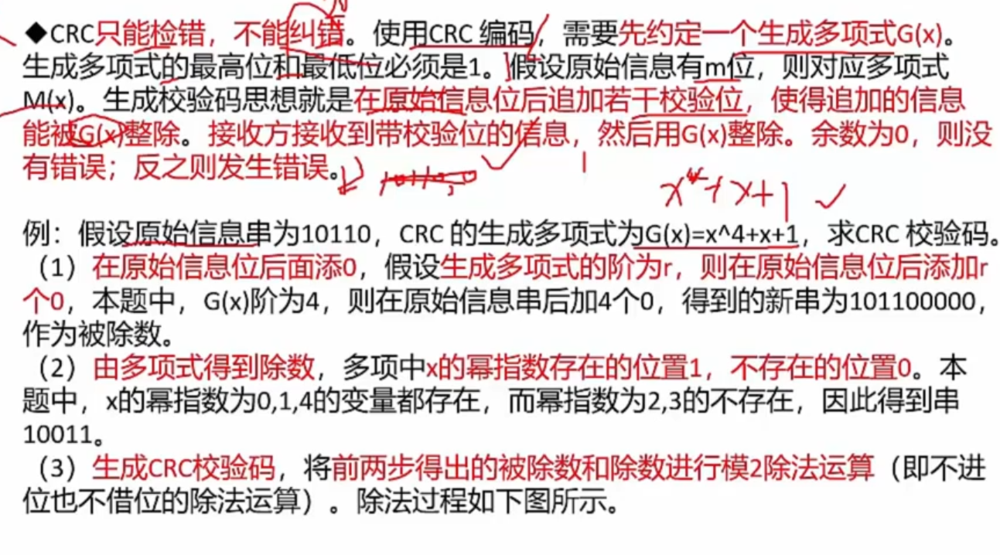

除数为什么是`10011`，因为多项式为 `x^4 +x^1 + 1`，1 就是 `x^0`，最高次方为4，所以有5位，且`倒着`数 - 0次方、1次方、2次方、3次方、4次方，正好 `10011`

 **模2运算** - `异或`运算 - 同0异1

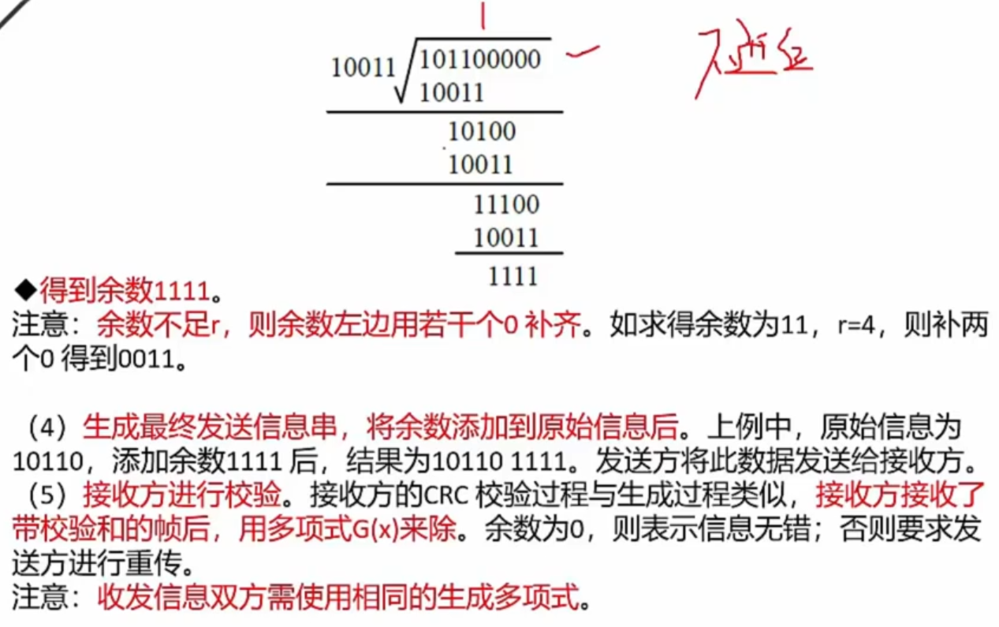

## 2. 指令系统

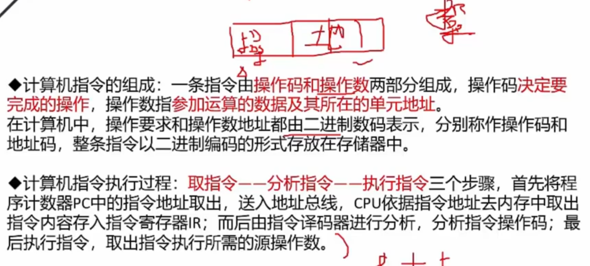

一个操作码 + N个地址码，地址码从`（程序计数器） PC`中取出来

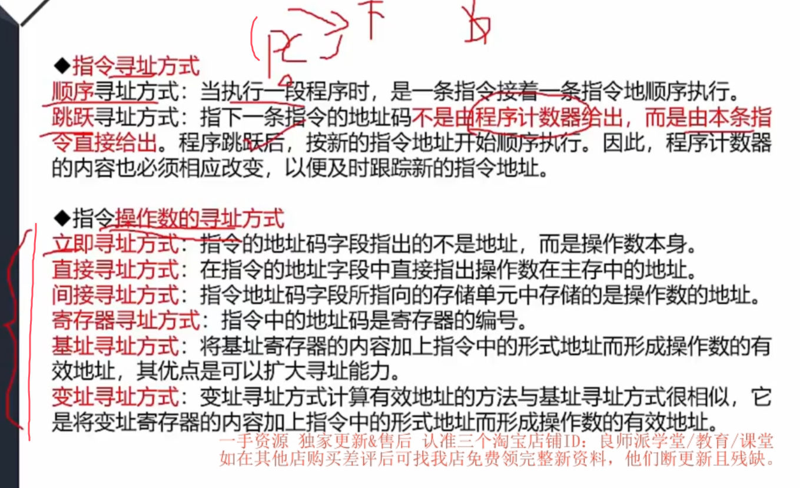

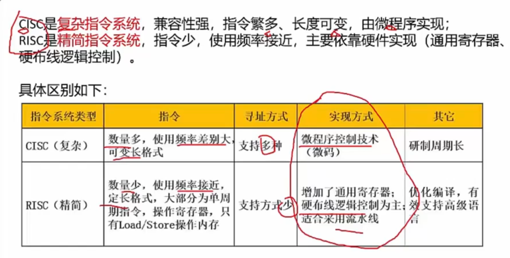

实现方式记一下

单词

CISC - **complex** instruction set computer

RISC - **Reduced** instruction set computer - 减少的、简化的

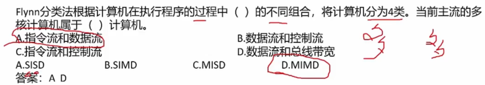

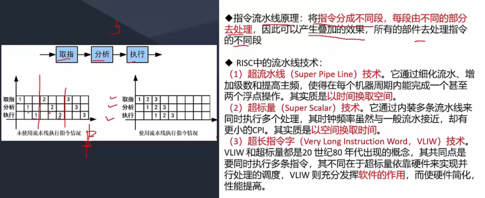

如图，流水线，能够取指、分析、执行，各自有各自的构件去执行

仅限于 **精简指令集** 用

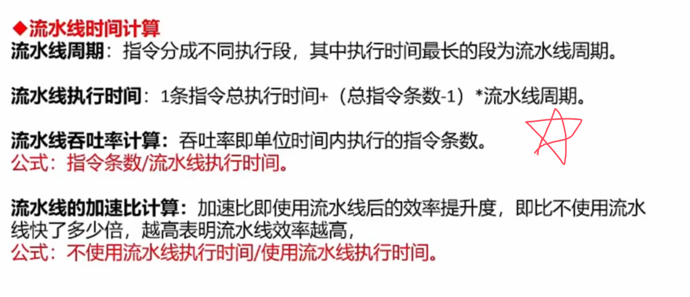

**这里是计算，是个重点**

周期：取最长那段即可，并非所有段相加

流水线执行时间 直接记住吧，我没看懂？看起来和上上张图，流水线重叠有关，见下题用法

加速比：是个大于1的数字

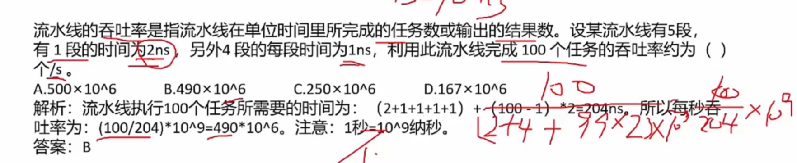

## 3. 存储系统

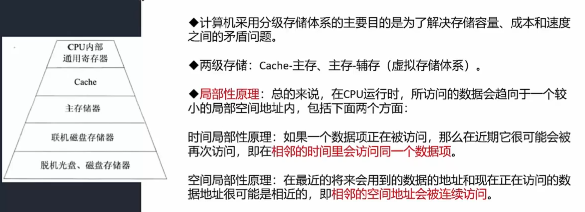

- 寄存器 - 32bit / 64bit

- Cache - 3MB等 - 高速缓冲寄存器 - 现如今技术也分为`多级缓存`了

- 主存储器 - 内存条 - 8GB

- 联机磁盘等 - 硬盘 - 1TB等

**Cache的特点**

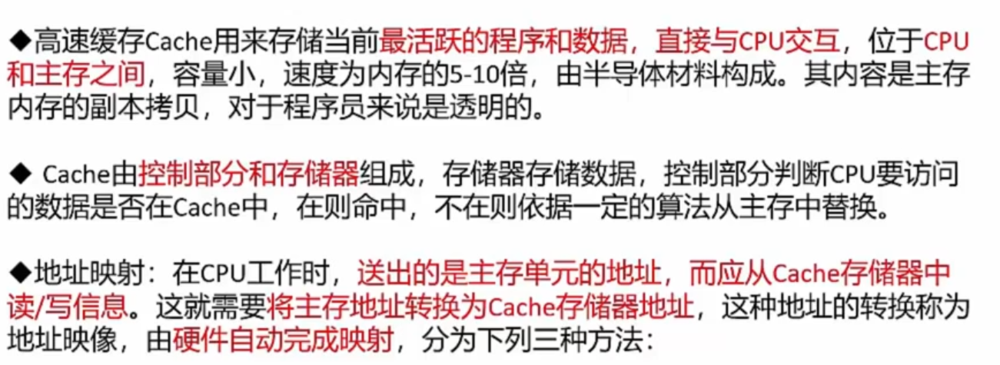

>  地址映射，由**硬件自动完成** - 重点考点送分题 ！！！

三种方法

- 直接相联 - 把cache和内存，切成相同的块数量，但是cache的量都是mini版 - `冲突概率`
- 全相联映射 - 没有规定块号相等了，随便乱对应，但是要一一对应，复杂、但是无浪费
- 组组相莲映射 - 先分块，再分组；组和组之间直接相连，组内全相联映射

三种方法 **块冲突概率**，由高到低  - `直接映像 -> 组组相恋映像 -> 全相联映像`

内存调入cache时的**替换算法**

- 随机替换算法
- 先进先出算法
- 近期最少使用算法 - 最常用算法 - 利用了局部性原理
- 优化替换算法 - 需要先执行一次，统计cache的替换情况，然后找出最有效的方法

cache的命中率 （CPU访问的数据正好在cache中的概率）

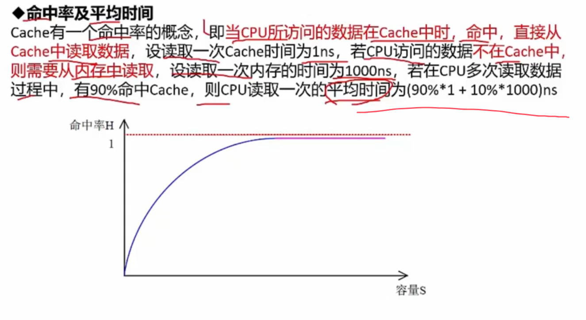

本质上来说是有漏洞的。因为cache 100%访问了，10%的概率再访问内存。
但是这个完整版逻辑知道就行，考试用的就是上图中的算法
平均时间 = `cache概率 * cache时间 + （1-cache概率） * 内存时间`

### 磁盘

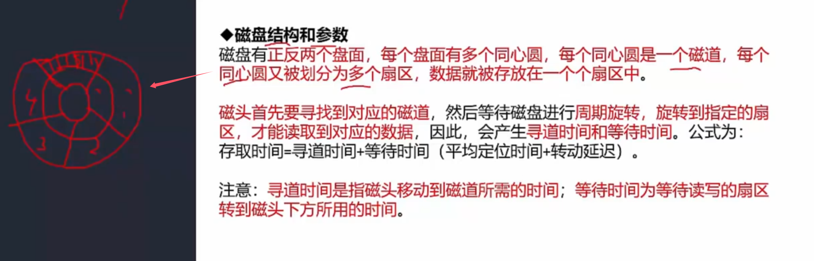

注意，N个圆环，每个圆环被切成假设是8片，那么 - 每一个`局部扇片`就是 一片存储区域，所以一共有 `8N`个扇区

存取时间 = `寻道时间` + `等待时间（旋转时间）` 

- 寻道时间 - 纵向地移动，找到指定的 `圆切` - 耗时最长

- 等待时间 - 沿着这个圆切旋转，等待`指定的扇区`的到来 - 因为转速比如7200转，贼快呢，所以等待时间短

- PS: 因为磁盘可以有Y层，也就是Y个盘面，所以其实存储扇区其实有 `8NY` 个，见下图

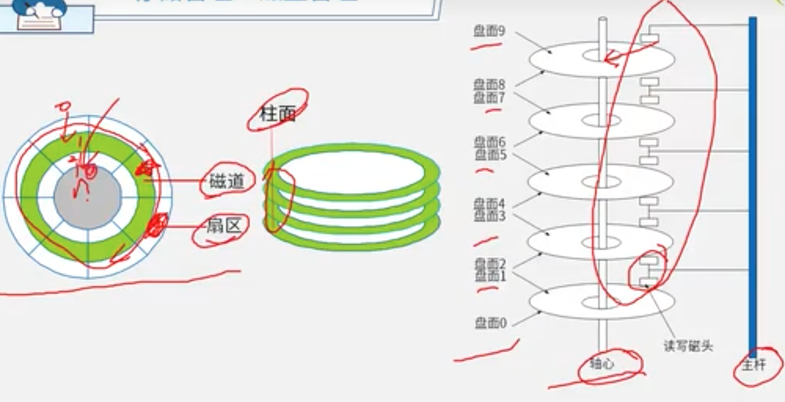

> 柱面 依旧是 磁道

#### 磁盘调度算法

算法是针对多个进程的请求，如何处理每个请求需要获取数据的顺序

- 先来先服务 FCFS
- 最短寻道时间优先 SSTF - 哪个进程`请求的磁道` 距离当前最近，那么先处理那个进程
- 扫描算法 SCAN - `电梯算法`，往`一个方向处理`，处理`完了就掉头`
- 单向扫描调度算法 CSCAN - 类似扫描算法，但是`处理完了也不掉头`，一直走到底再掉头，有点进程等它而不是它找进程的感觉

## 4. 输入输出技术

`内存与接口地址` 的编址方法 - 了解

- 独立编址方法 - 接口的指令少，功能弱
- 统一编址方法 - 导致地址空间不连续

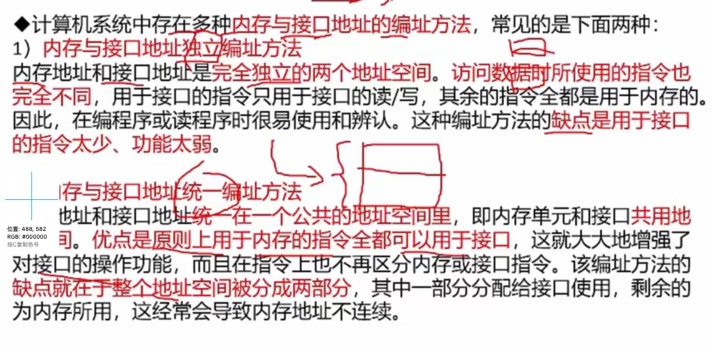

`计算机 和 外设之间` 的数据交互方式 - 重点

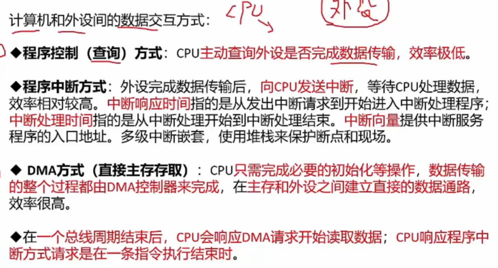

最后一句，`CPU响应时间判断节点`很重要

时钟周期、机器周期、指令周期。

## 5. 总线

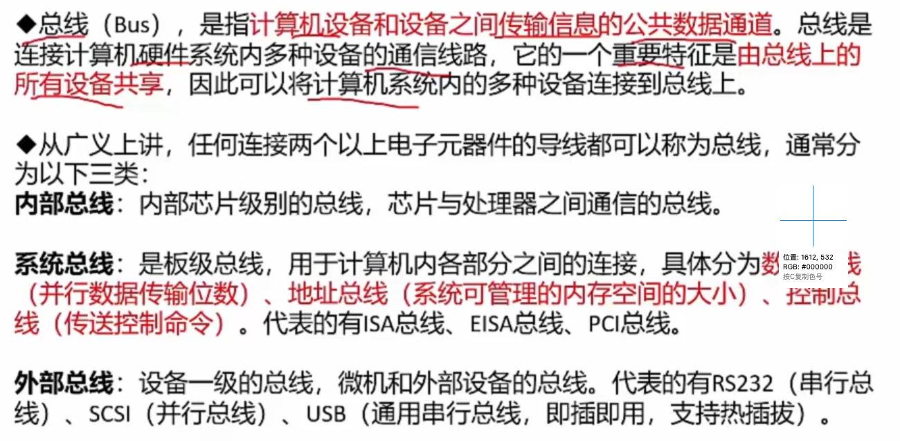

硬件层面，接到主板上的线，都属于总线

内部总线、系统总线、外部总线 - PS：仅作了解，非书本上的

> 书本上的总线分类： 数据总线、地址总线、控制总线

地址总线：比如32位系统，一般用于4GB内存。64位系统，可用于8GB+内存

- 串行总线 - 适合长距离传输，是低速的
- 并行总线 - 适合短距离传输，因为成本太高；高速
- 单总线 - 所有设备挂在一条线上，设备之间通信会被堵塞，同一时间只有一个设备能发送数据，大家都可以接收这个数据，设计复杂导致性能降低
- 半双工总线、全双工总线、单工总线
  - 单工 - 只能A传输给B，不能B -> A
  - 半双工 - 可以 A->B，也可以 B->A，但是`同一时刻只能在一个方向上`传输信息
  - 全双工 - 半双工基础上，同一时刻，可以同时 A->B & B->A

