# 10. 软件工程基础知识

1. 概述（第一版）
1. CMM（能力成熟度模型）
1. 软件过程模型
1. 逆向工程

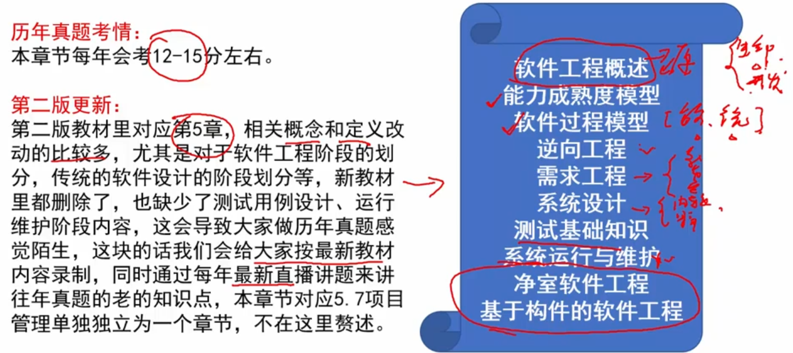

## 1. 软件工程概述（第一版）

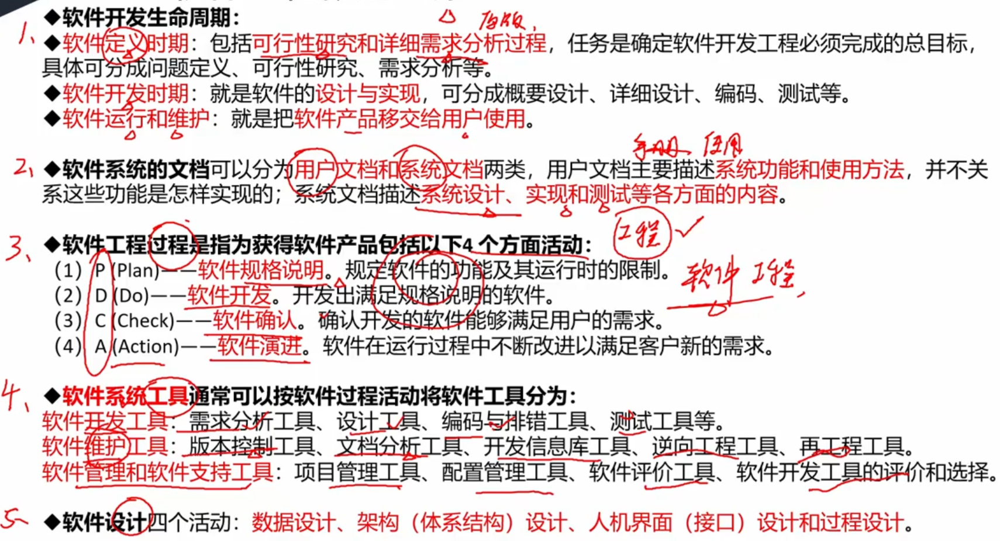

## 2. CMM（CMMI） - 能力成熟度模型

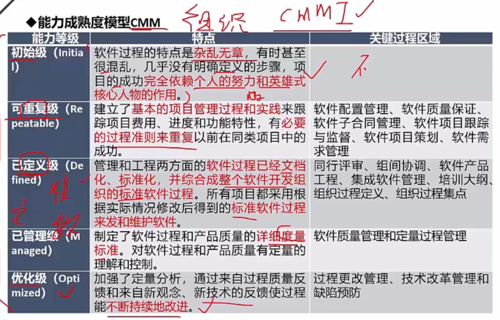

关键过程区域倒是不需要记住，左侧五个能力必须记住

### CMMI

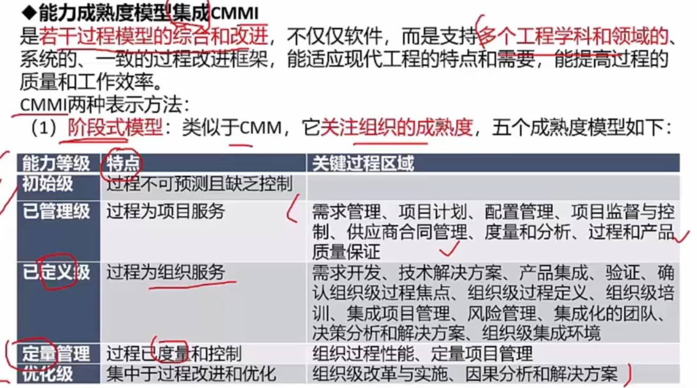

第一种 - 阶段式模型是考点，

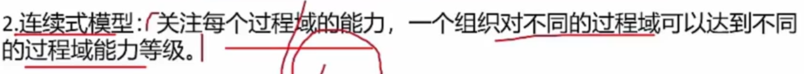

了解即可 - 连续式模型有六级

## 3. 软件过程模型

>  瀑布模型，逐渐被淘汰了，适用于小型项目

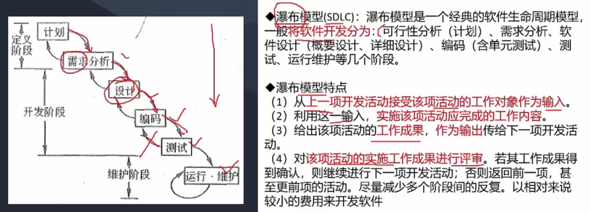

>  原型模型 - 解决需求不明确时的场景

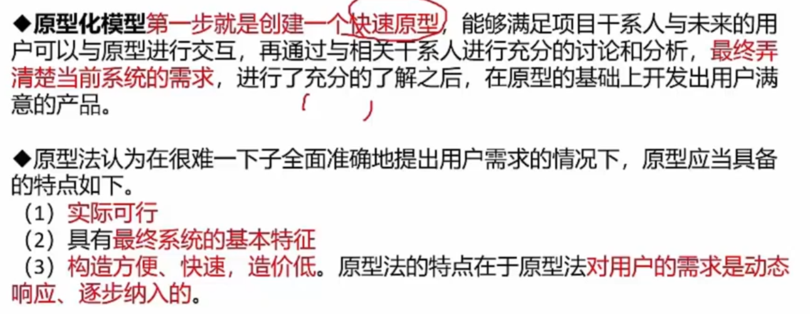

> 螺旋模型 - 瀑布模型+原型模型的组合
>
> 考点在于 - 它强调了 `风险分析`!

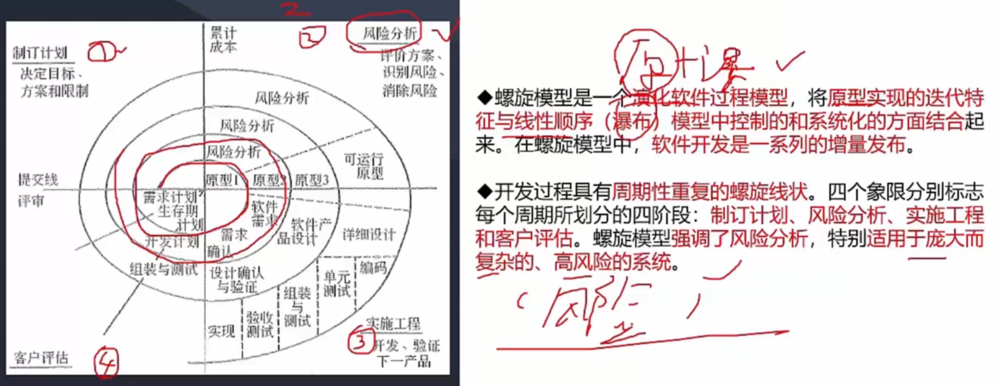

> V模型 - 强调了测试的重要性
>
> 考点：生命周期和测试方式的一一对应

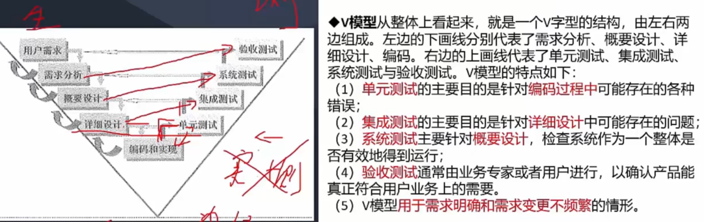

> 增量模型 - 分批次交付

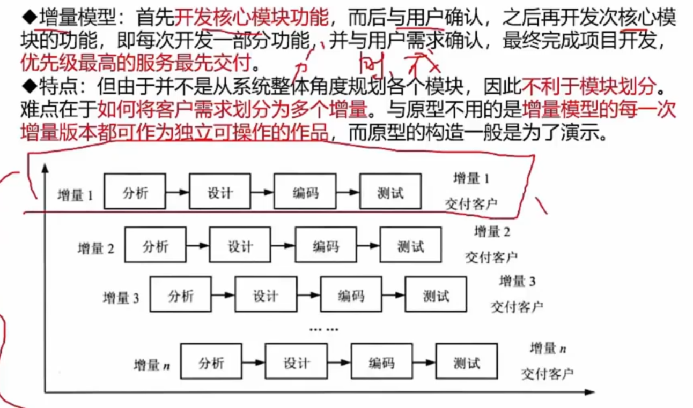

> 其他模型

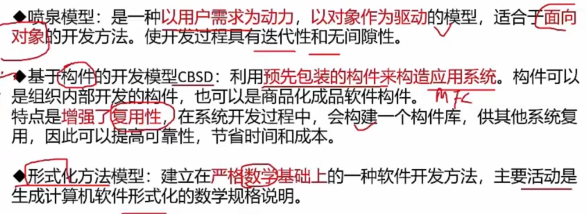

### 敏捷开发模型

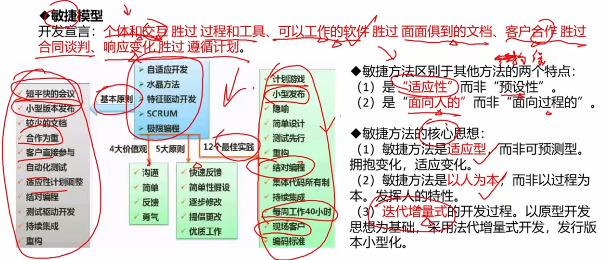

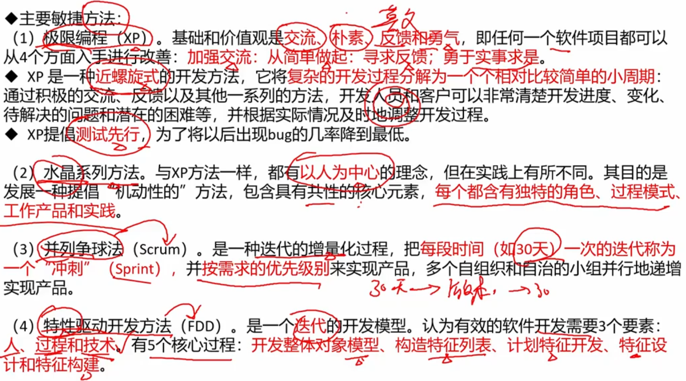

### 统一过程模型RUP

> 敏捷模型是轻量级，统一过程模型是重量级的
>
> 也是个螺旋迭代的过程

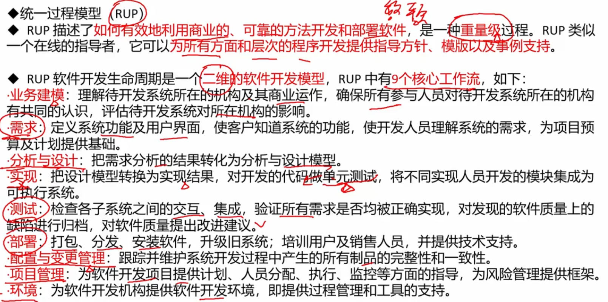

> 四个阶段

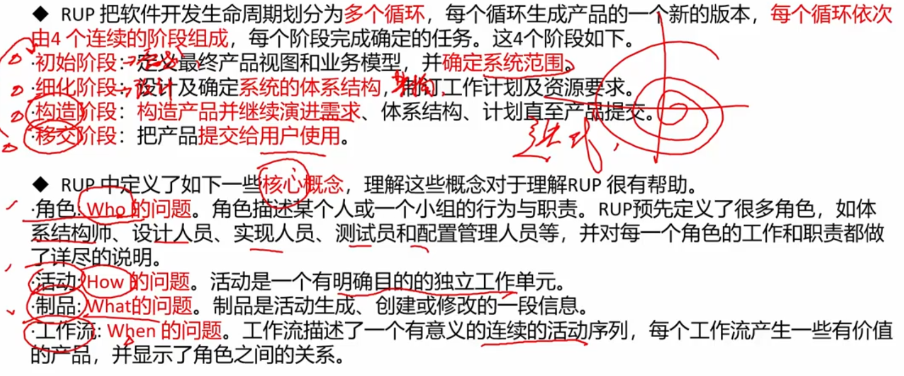

> 三个特点

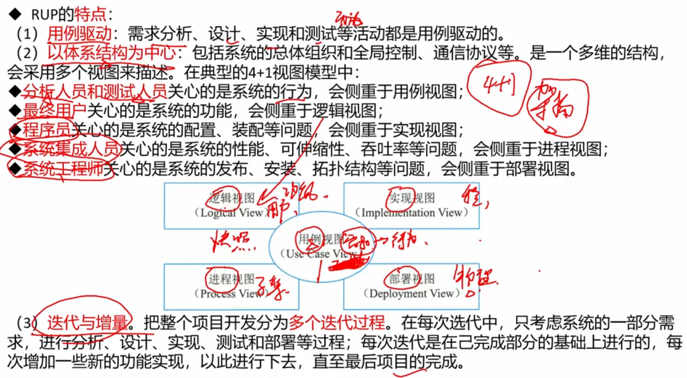

## 4. 逆向工程

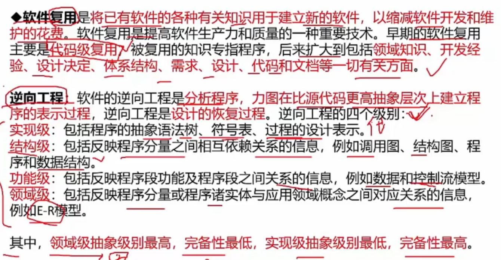

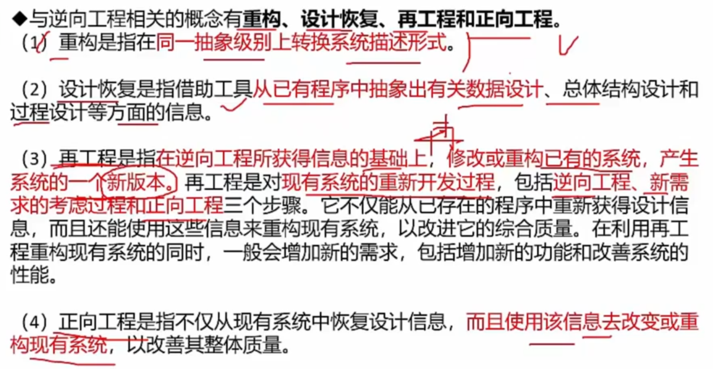

真题

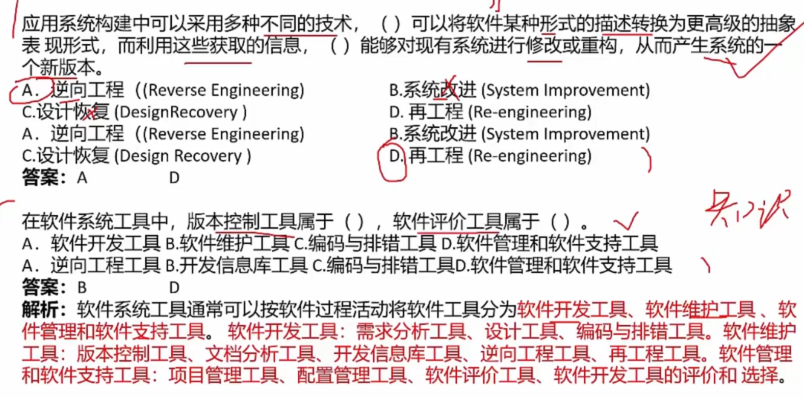
