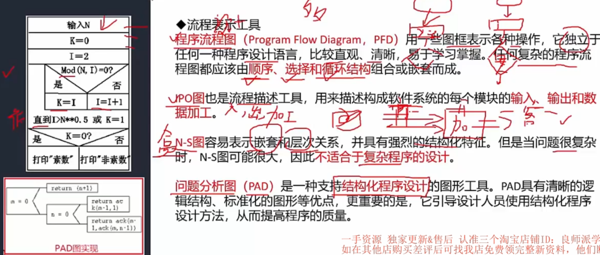

# 10. 软件工程基础知识

6. 处理流程设计 - 重点
7. 系统设计
8. 人机界面设计

## 6. 处理流程设计

#### 流程表示工具

- IPO - Input、Process、Output
- N-S 图 - 又称盒图，本身复杂，所以不适合显示复杂程序设计
- PAD - 特点：结构化

#### 业务流程重组BPR - Reengineering

 #### 业务流程管理BPM - manage

## 7. 系统设计

- 扇入 - 被调用；扇出 - 被其他组件调用

#### 内聚 & 耦合 - 必考

## 8. 人机界面设计

