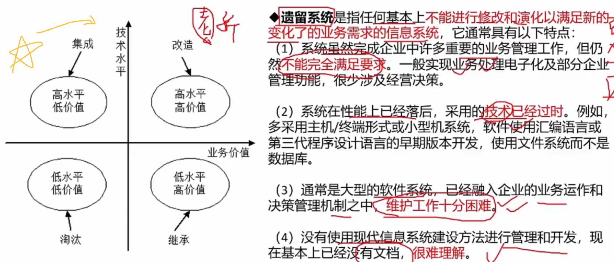
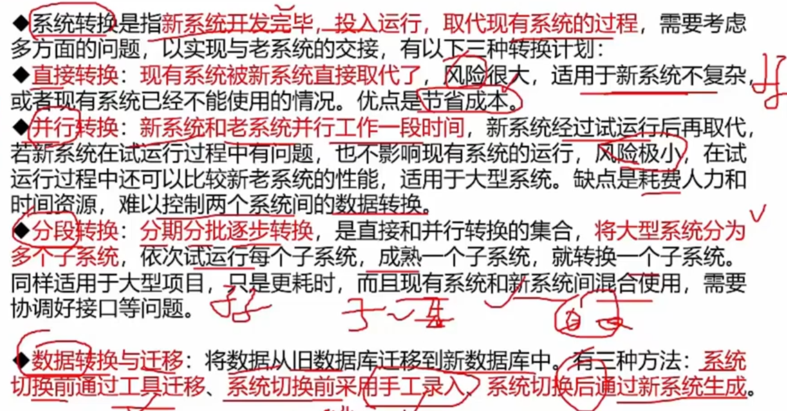
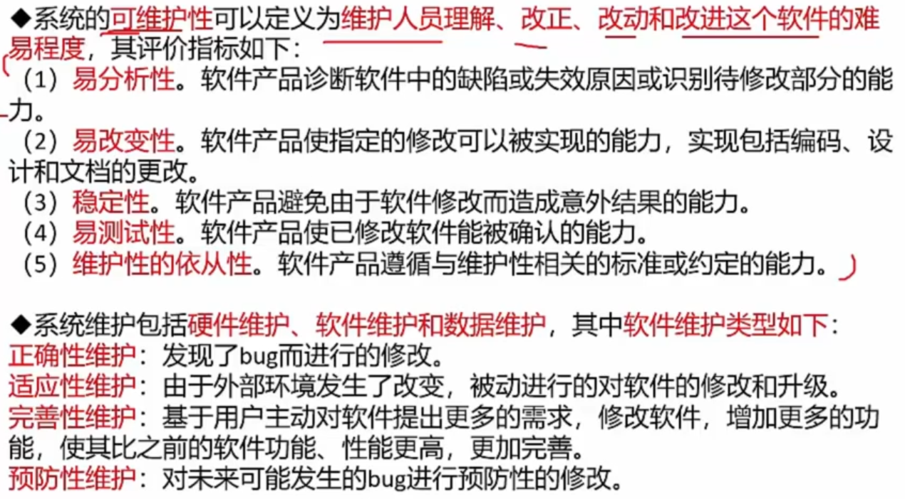
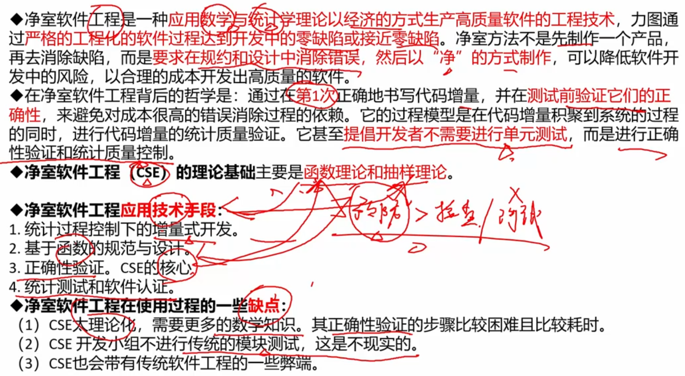
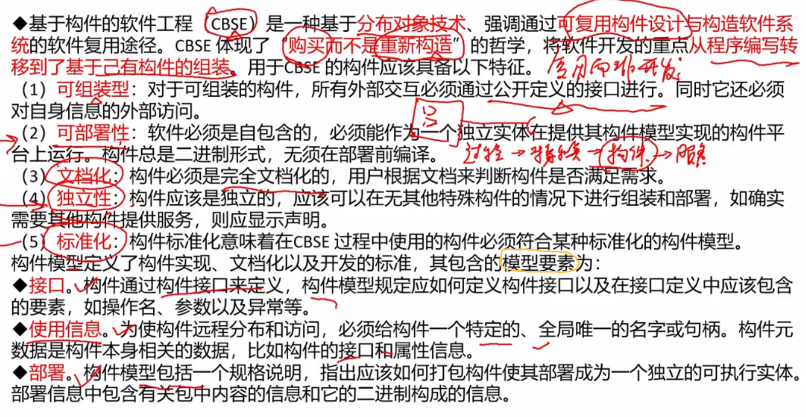
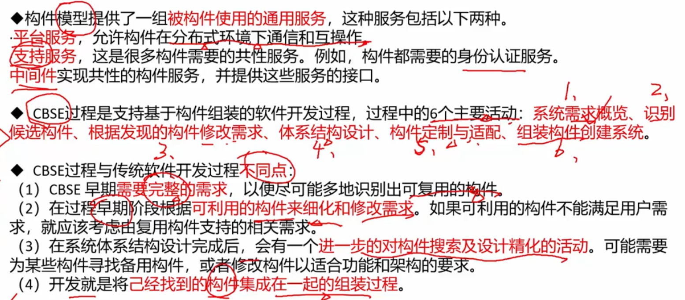
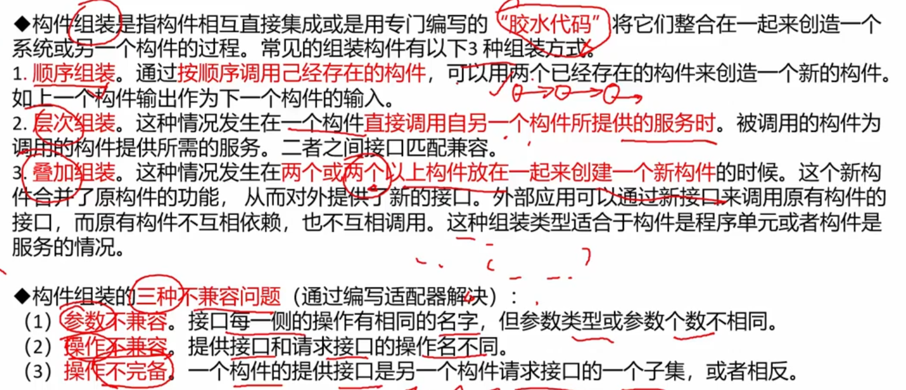

# 10. 软件工程基础知识

10. 运行和维护 （系统转换、系统维护、净室软件工程、基于构件）

## 10. 运行和维护

### 系统转换

左图很重要 - 根据遗留系统的技术水平和业务价值，决定对它进行 `淘汰` / `集成` / `继承` / `改造`

### 系统维护

> 在整个生命周期中，耗时最长、开销最高

全部记住！

### 净室软件工程CSE

>  预防大于测试

### 基于构件的软件工程CBSE

> 强调复用而非重新开发；用轮子而非造轮子

