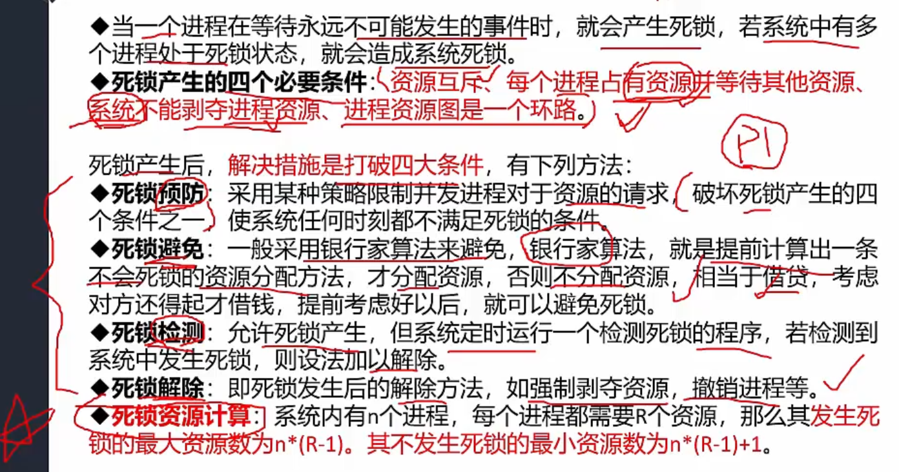
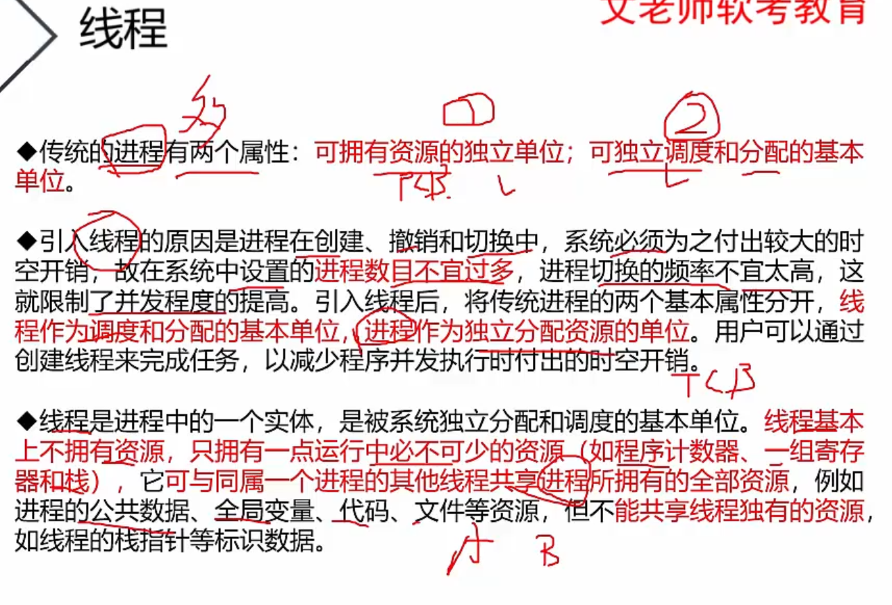
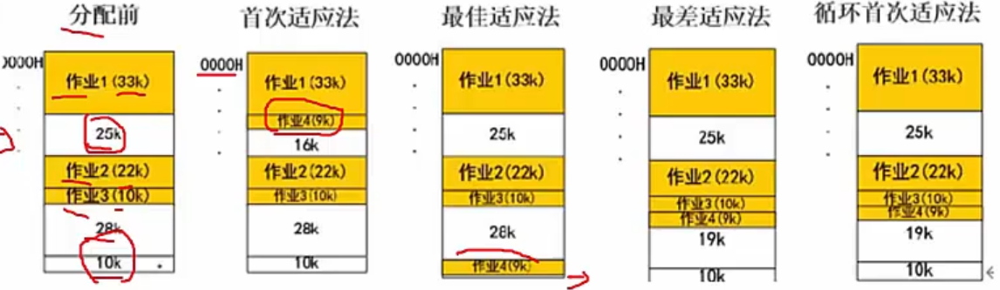
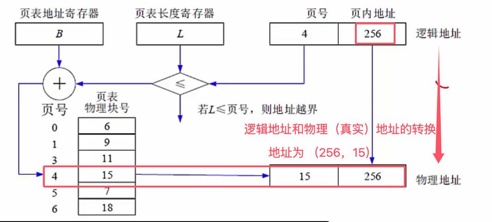

# 操作系统知识

4. 进程管理

## 进程调度

> 概念知识，了解即可

**进程**

更高优先级进程进来后，如何分配CPU

- 可剥夺
- 不可剥夺

一个作业从提交到完成需要经历 `高 -> 中 -> 低` 三级调度

- 高级调度 - 长调度；作业调度；接纳调度。一个作业只有一次

- 中级调度 - 中程调度；对换调度。决定处于**交换区**的哪个就绪进程可以调入内存
- 低级调度 - 短程调度；进程调度。最活跃、最重要

**进程调度**的算法

- 先来先服务 FCFS - 用于宏观调度

- 时间片轮转 - 比如每个进程轮流使用10ms的cpu；用于微观调度

- 优先级调度：每个进程都有一个优先级；运行中的，就看是否可剥夺了

- 多级反馈调度 - 时间片轮转+优先级调度的结合而成；队列内部用优先级；队列之间用时间片轮转

**死锁**

现在的操作系统，基本都能剥夺进程资源，就是为了避免死锁

死锁四个必要条件：

死锁资源计算：n个进程，每个进程需要R个资源，发生死锁的最大资源数为 `n*(R-1)`；不发生死锁的最小资源数为 `n*(R+1)+1`

理解一下：每个进程只有R-1个资源，每个进程都死在最后一步，所以`n*(R-1)`，再多给一个资源就可以解除死锁 

**线程**

- 传统进程2个属性 - 1. 可拥有资源的独立单位 2. 可独立调度和分配的基本单位

- 线程自己基本不拥有资源，但是进程内所有线程之间资源可以共享；进程之间的切换耗费资源，不宜过多

- 线程要考虑多并发，所以要加锁

### 内存分配方式

**分区存储管理**

就是**整存** ，有三种分区方式

1. 固定分区 - 会产生内部碎片（浪费掉的部分）

2. 可变分区 - 作业转入时划分；会产生外部碎片（小于要被分的存储而不得不浪费）

   1. 算法：首次适应法、最佳适应法、最差适应法、循环首次适应法

   

3. 可重定位分区 - 解决碎片问题（扩大碎片）

**分页存储管理**

逻辑页分为 页面 和 页内地址

页内地址就是第N页，页内有许多页号，每个页号对应一个物理块号相对地址M，所以内存真实物理地址X = 页内地址N+相对地址M

优点：利用率高，碎片小，分配及管理简单

缺点：增加了系统开销，可能产生抖动

页面置换算法

1. 最有算法：OPT - 无法实现
2. 先进先出算法：FIFO - 就是它产生抖动
3. 最近最少使用：LRU - 局部算法，效率高，淘汰原则类似垃圾回收机制，优先回收访问少的

`快表` - 只存 `当前访问最频繁的页面的页号`，存在`cache`中。页表放在`内存`中

慢表需要访问两次内存；快表访问一次cache（获取对应关系），和一次内存（获取实际数据），所以更快

 **分段存储管理**

相比于固定的页，这里是一个个的不同的`段`，物理大小也不同了

有段长和基地址

**段页式存储管理**

没考过，了解就行。

段里面，进行分页

优点：结合了上面所有的优点

缺点：复杂，开销也较高

>  Q: 地址这块没学懂，据说属于 中级知识，回头补一下吧
>
> 二进制也不会。。。
