# 操作系统知识

1. 设备管理

2. 文件管理

## 1. 设备管理

### 设备管理概述

> 概述 - 了解即可

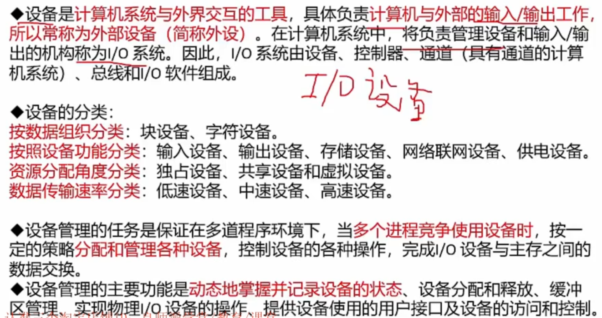

块设备是高速设备；独占就是互斥设备；  虚拟设备：通过一些技术把独占设备转换成共享设备，比如打印机

I/O设备是和`主存CPU`进行**数据交换**的，并 `不和硬盘` 进行交互

### I/O软件 - 小考点

> I/O 软件，考点，主要考下图中间三层

用户进程 -> 设备无关软件 -> 设备驱动程序 -> 中断处理程序 -> 硬件

分层是为了**隐藏操作实现细节**， 也并没有向用户提供物理接口，只提供程序接口。

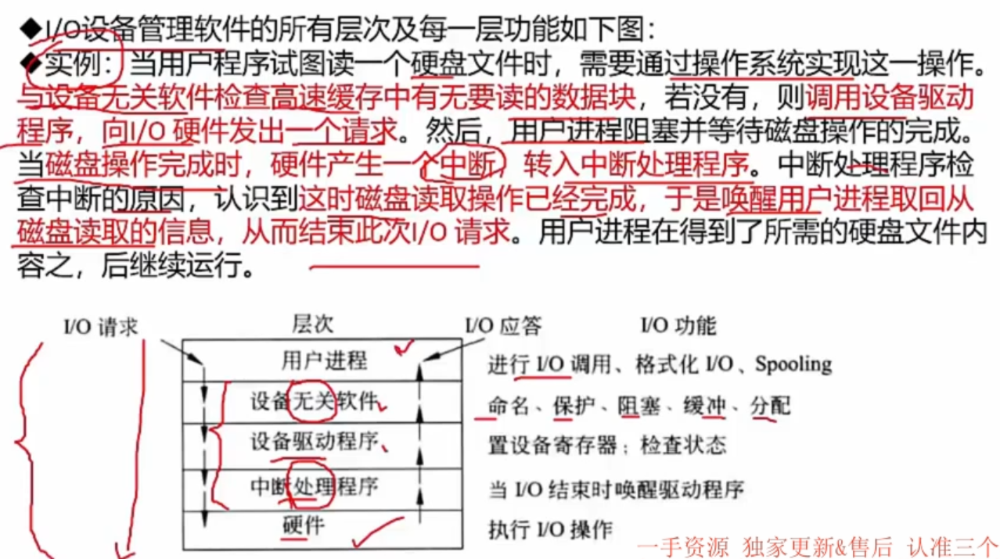

### 设备管理技术

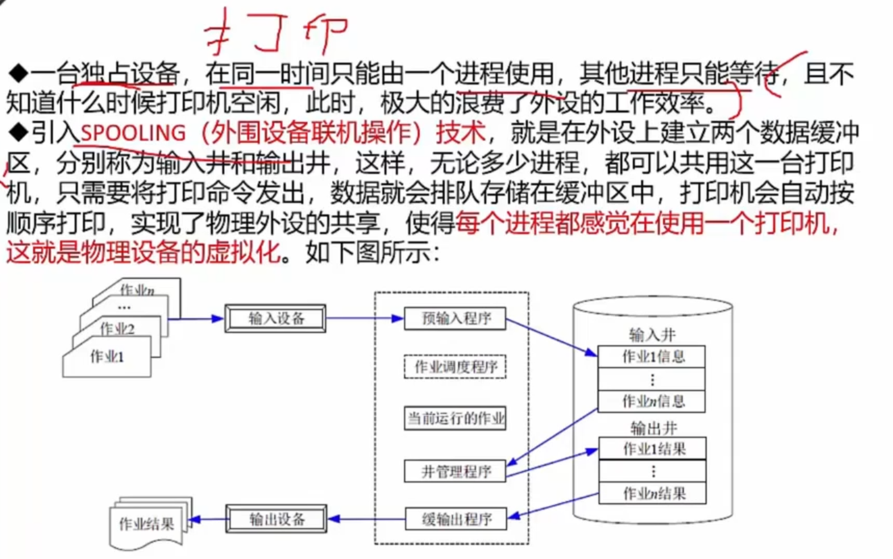

- 独占时：有人在用打印机，那么其他人使用的话，直接报错

- 共享时：有人在使用，其他人可以进来排队，不会失败

## 2. 文件管理

### 概述 - 了解即可

文件不只是文档，所有存储都是文件，无论是dll还是exe

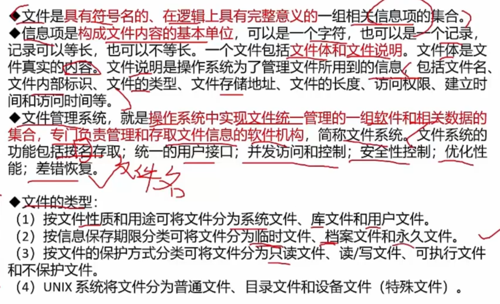

### 文件结构

逻辑结构

- 有结构 - 记录式文件
- 无结构 - 流式文件

物理结构

- 连续结构
- 链接结构
- 索引结构 - 系统里面有一个索引表 - **考点**
- 多个物理块的索引表

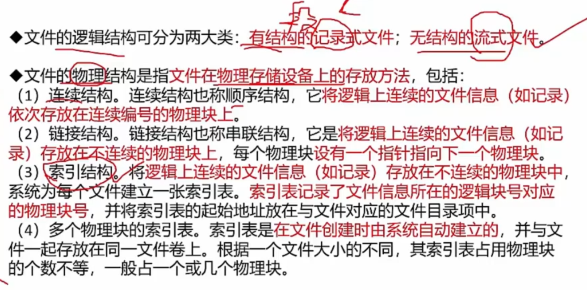

### 索引文件结构 - 考试重点

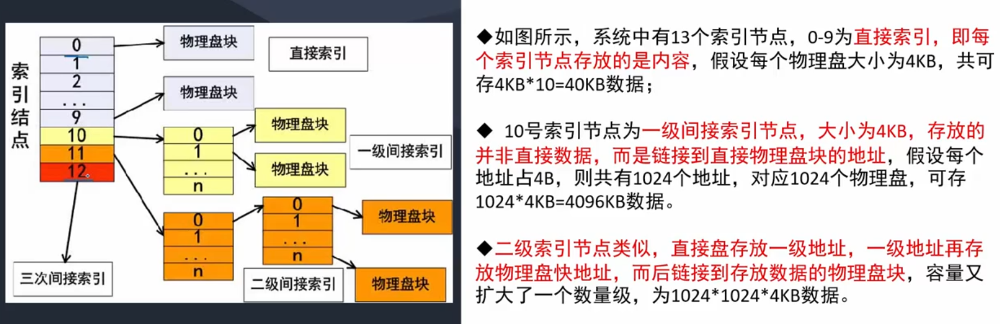

- 可以无限扩大为N级索引节点
- 直接索引 - 直接指向某个物理盘块
- 间接索引 - 链接到`直接物理盘块的地址 / 连续的直接索引`，由此指向到物理盘块
  - 多级索引，起点是大的，比如图`节点12`，称呼它为三级索引，因为它后面有 `二级` 和 `一级`（正确）。千万别认为是 它是`一级索引`, 下一步指向`二级索引`（错误）
- 作为直接索引，相当于一个物理盘块，即`一个逻辑块号`，但是作为间接索引，因为不指向任何物理盘块，所以它没有 `逻辑块号`

>  一个常识 - 考题中没有指定的话，所有的，比如`逻辑块号`，都是从 **0** 开始的，比如`逻辑块号 = 5`，则它是 `第 6 块`
>
> 什么是逻辑块号：**数据块的存储方式**。
>
>  详细版： 计算机系统中用于标识 存储设备上的数据块 的一种编号方式

**真题：**

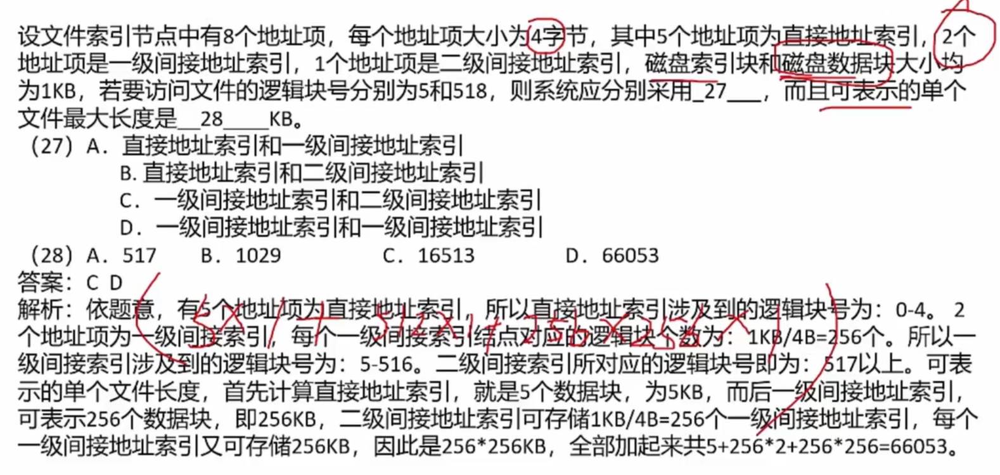

## 3. 文件目录

> 记住一句话 - 文件控制块 的 有序集合 称为文件目录

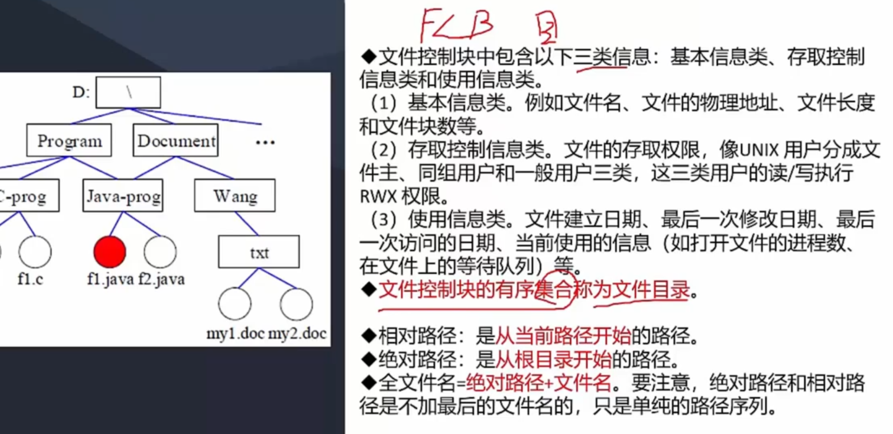

- 左侧图中有一个小知识点，Java-prog 文件夹，是`软链的形式`存在于 Program or Document 中

- 相对路径中，开头可以是 `./`，或者是直接`文件夹名`，可不能是 `/`，最后这个代表根目录

## 4. 文件存储空间管理

> 重点在于： 文件存储空间管理 - 位视图（bitmap）

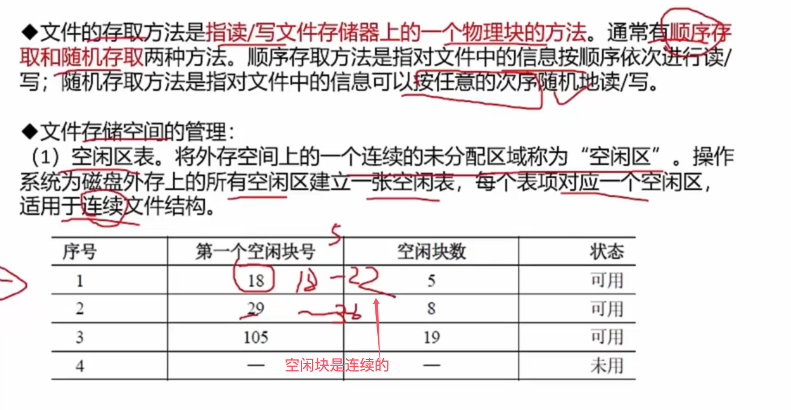

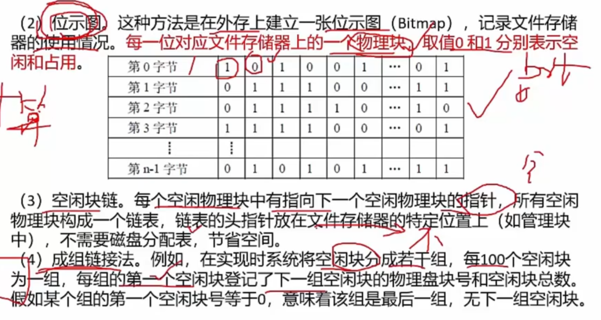

一道考题，含着好几个知识点，反正我不懂

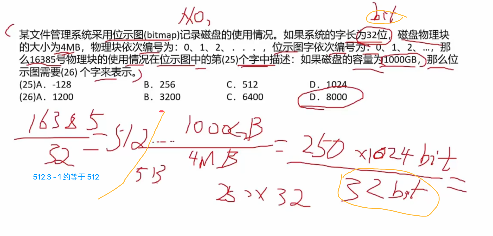
