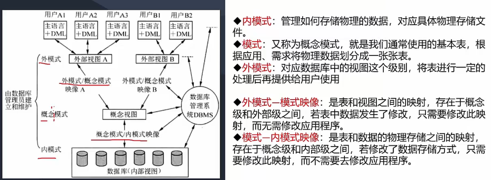

# 数据库技术基础

1. 概述

2. 三级模式

3. 数据库设计

4. 数据模型

> 普通题5-6分，大概率占有一道大题！重点！！！

## 1. 概述 - 了解即可

>  我们用到的、主流的数据库，都是`关系模型`，基本没用过其他的。典型特征 - 有表sheet

数据库系统DBS（database system）：

## 2. 三级模式-两级映像（映射） - 重点

- 内模式直接和数据库存储模式相关，和物理存储相关
- 概念模式基本就是和 表sheet 对应
- 外模式跟用户/SQL语句相关，对应表的视图相关
- 两级映像的最大作用 —— 做隔离，让互不影响

## 3. 数据库设计 - 重点

>1. 记住四个流程
>2. 每个流程的作用
>
>3. 四个流程的输出/产出是什么

1. 需求分析  - 产出物：数据流图、数据字典、需求说明书
2. 概念结构设计 - 产出物：E-R图（实体-联系图）
3. 逻辑结构设计 - 产出物： 关系模式（表的列属性）
4. 物理设计 - 产出物：物理数据库

## 4. 数据模型

- 四种模型，重点是关系模型和概念模型

- 概念模型是E-R图，关系模型是表格

- 数据模型 三要素（**考点**）：数据结构、数据操作、数据的约束条件

### E-R图（Entity-Relationship Diagram）： - **需要记住**

- 图中，数字`（1、*）`表示联系之间的类型：`1对1`、`1对多`、`多对多`；

- 长方形表示实体；加了两道杠（比如经理）表示**弱实体**，弱实体和强实体连接，用`圆圈o` 连接

- 派生属性：可以由其他属性计算得来的
- 码（key），又叫做 键，唯一标识。 重点！

### 关系模型

- 行，叫元祖、也叫水平记录
- 列，就叫属性

### E-R模型转换为关系模型

> E-R图 并不是我们真正需要的，它存在的目的是为了 转换为关系模型

- 上图换个说法，也就是 关系键（比如id），放在哪个表里
- 1:N 和 M:N 是最常考的；1:N中（比如店铺和员工），多（员工）里面增加一个id（店铺id）指向1； M:N中（比如商品和属性），需要第三个表，key为`M_N`，维护两者关系
