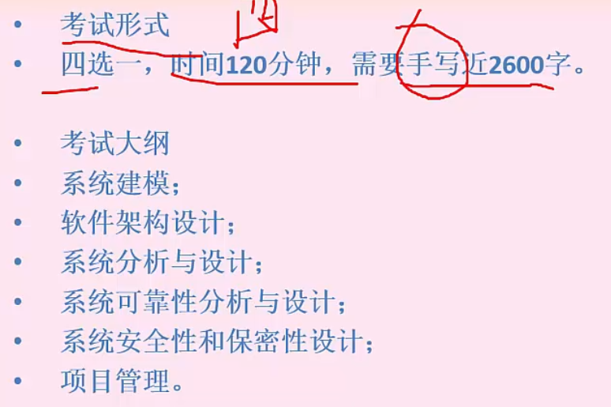
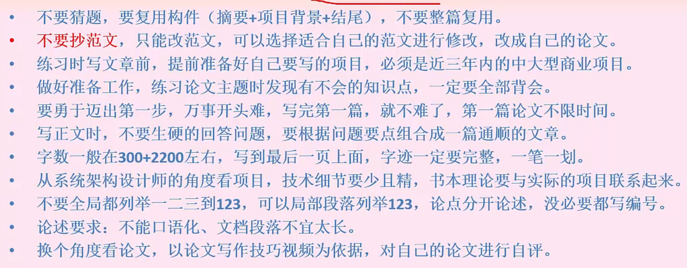
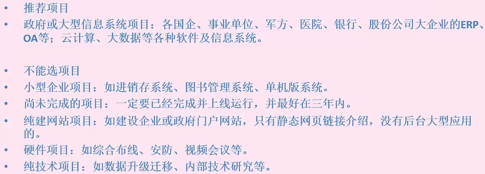
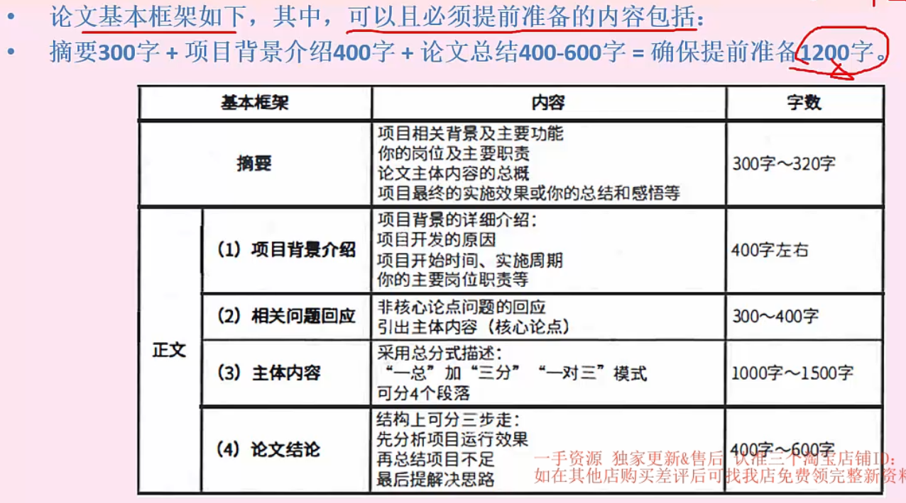
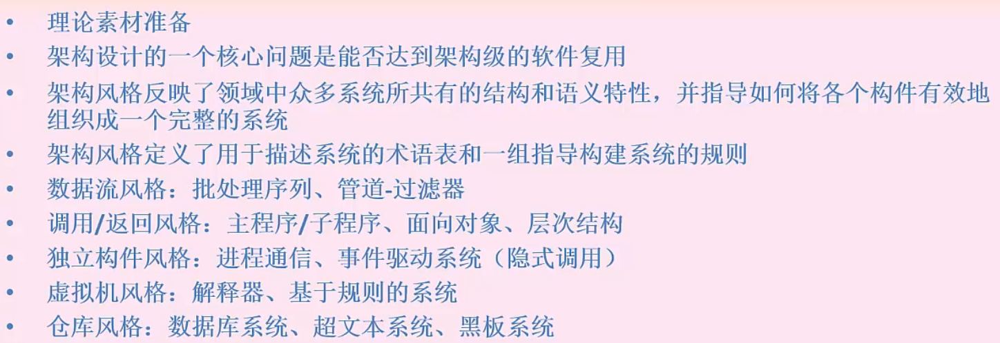
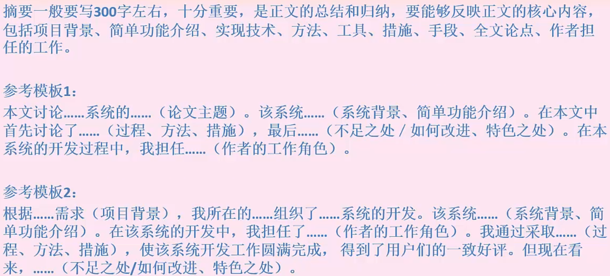
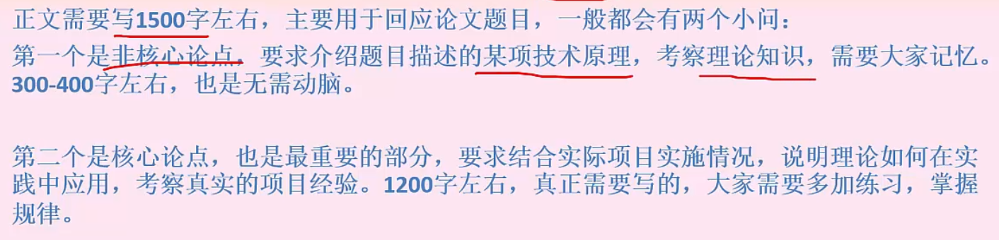

# 论文写作

> 2600字 = 300字摘要 + 500字背景 + 1500字正文 + 300字总结

## 一、概述

### 大纲

### 写作原则

### 评分标准

## 二、细节分析

### 1. 前提

#### 立项

> 选择项目 - 时间较新、中大型商业项目、研发周期大于10个月、已交付验收

#### 论文基本框架

岗位 - 系统架构设计师或者分析师！

#### 理论素材的准备

### 2. 摘要

### 3. 背景介绍

### 4. 正文

## 5. 结尾

不足之处 — 一两个就够了

## 三、精华主题总览（非押题）

